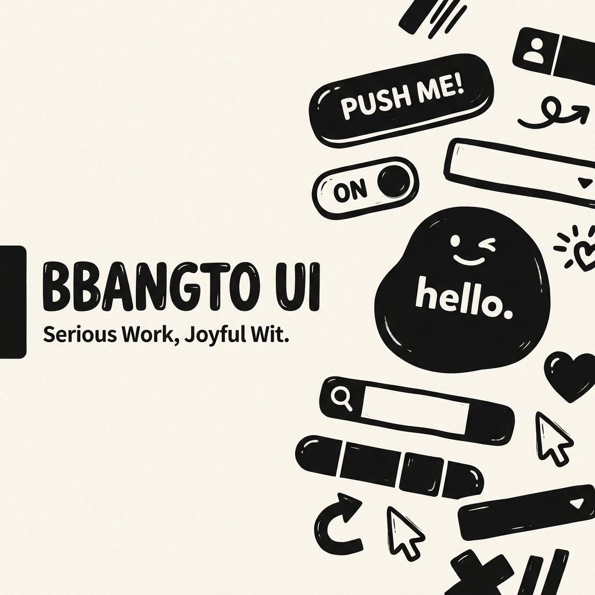

<div align="center">
  
</div>

# BBANGTO UI

> **Serious Work, Joyful Wit.**

BBANGTO UI는 진지한 엔지니어링 기반 위에 즐겁고 위트 있는 사용자 경험을 제공하는 모던 리액트 디자인 시스템(Design System)입니다. 무광택(Matte), 플랫(Flat), 그리고 손그림 느낌의 블랍(Blob) 스타일 아이콘 100여 종을 포함하고 있으며, 확장 가능한 테마(Theme)와 디자인 토큰(Tokens) 구조를 제공합니다.

---

## 📦 Packages

본 레포지토리는 Monorepo 구조로 설계되었으며, 주요 패키지 구성은 다음과 같습니다:

- **`@centurio87/core`**: UI 컴포넌트 라이브러리 및 커스텀 생성 아이콘
- **`@centurio87/tokens`**: 디자인 토큰 시스템 (Colors, Spacing, Typography 등)
- **`apps/storybook`**: 컴포넌트 카탈로그 및 문서화를 위한 Storybook 환경

## 🚀 Getting Started

### 1. Installation

이 패키지를 프로젝트에 설치하려면, 패키지 매니저(예: pnpm)를 통해 `@centurio87/core`와 `@centurio87/tokens`를 추가하세요. (추후 npm 배포 시 사용 가능)

```bash
pnpm install @centurio87/core @centurio87/tokens
```

### 2. Theme Provider Setup

애플리케이션의 최상단에서 `ThemeProvider`를 사용하여 디자인 토큰과 테마를 주입합니다.

```tsx
import React from 'react';
import { ThemeProvider } from '@centurio87/core';
import App from './App';

export default function Root() {
  return (
    <ThemeProvider theme="light">
      <App />
    </ThemeProvider>
  );
}
```

### 3. Usage (Components & Icons)

BBANGTO UI는 위트 있고 개성 넘치는 수많은 컴포넌트와 100여 종의 커스텀 아이콘을 제공합니다. 사용법은 매우 직관적입니다.

```tsx
import { Button, HomeIcon, SettingsIcon } from '@centurio87/core';

export default function Dashboard() {
  return (
    <div style={{ display: 'flex', gap: '16px' }}>
      <Button variant="primary" leftIcon={<HomeIcon />}>
        Home
      </Button>
      <Button variant="outline" rightIcon={<SettingsIcon />}>
        Settings
      </Button>
    </div>
  );
}
```

## 🎨 Custom Icon Pipeline

BBANGTO UI의 가장 큰 특징 중 하나는 **무광택(Matte), 블랍(Blob) 스타일의 자체 아이콘 생성 파이프라인**을 내장하고 있다는 점입니다. 

Lucide 아이콘의 구조적 뼈대를 가져와, 프로젝트의 `scripts/generate-icons.mjs`를 통해 두꺼운 둥근 테두리(`strokeWidth`)와 위트 있는 질감의 SVG 리액트 컴포넌트로 자동 변환합니다. 카탈로그에 새로운 아이콘을 추가하고 싶다면 이 스크립트를 활용해 무한히 확장할 수 있습니다!

## 🛠 Development

이 레포지토리를 직접 개발하거나 수정하시려면 아래 명령어를 사용하세요.

```bash
# 의존성 설치
pnpm install

# 전체 패키지 빌드
pnpm build

# Storybook 실행 (컴포넌트 및 아이콘 카탈로그 확인)
pnpm dev
```

---

<div align="center">
  <sub>Built with ❤️ by the BBANGTO Team.</sub>
</div>
