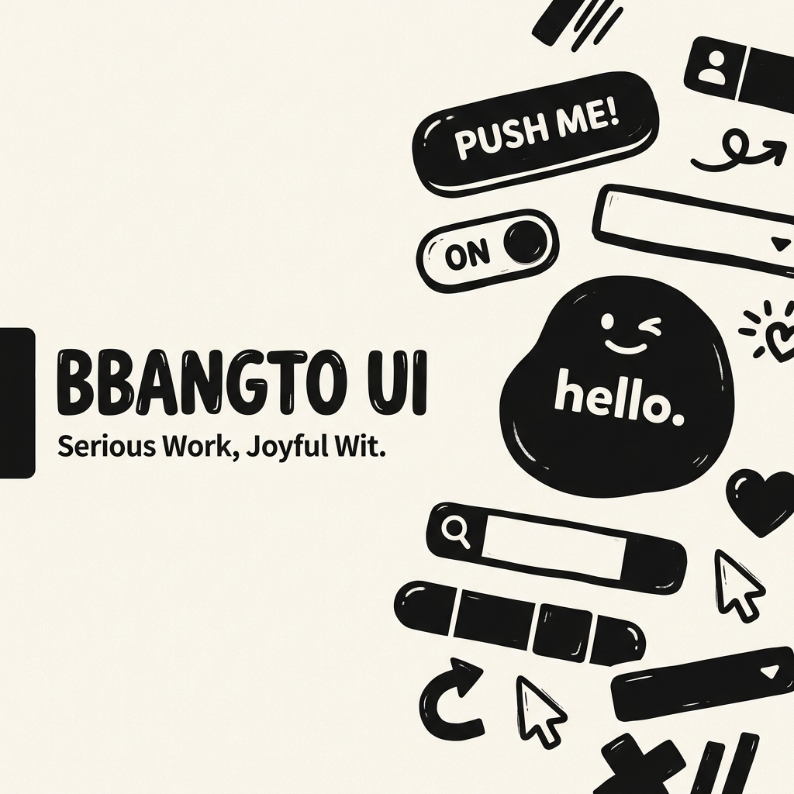

<div align="center">
  
</div>

# BBANGTO UI

> **Serious Work, Joyful Wit.**

BBANGTO UI는 진지한 엔지니어링 기반 위에 즐겁고 위트 있는 사용자 경험을 제공하는 모던 리액트 디자인 시스템입니다.

---

## 📦 Packages

본 레포지토리는 Monorepo 구조로 설계되어 있으며, pnpm workspace로 관리됩니다.

| 패키지 | 설명 |
|--------|------|
| `@centurio1987/bbangto-ui-core` | UI 컴포넌트 + 모션 레이어 + 패턴 + base foundation(light/dark/high-contrast) + StyleGuide/Foundation Provider |
| `@centurio1987/bbangto-ui-tokens` | 디자인 토큰 타입 정의 (Colors, Spacing, Typography, Motion 등) |
| `@centurio1987/bbangto-ui-foundations` | 확장 foundation 카탈로그 — amber + 브랜드 프리셋 74종 (base는 core 내장) |
| `@centurio1987/bbangto-ui-style-guide-catalog` | 사전 정의 style guide preset 24종 (core 기반) |
| `@centurio1987/bbangto-ui-hooks` | Headless React 훅 31종 |
| `@centurio1987/bbangto-ui-visualization` | headless 시각화 디자인 시스템 (diagram/infographic — atoms·molecules·patterns·templates) |
| `@centurio1987/bbangto-ui-visualization-style-guide-catalog` | visualization 스타일 가이드 preset 카탈로그 (Blueprint_Technical_01 등) |
| `apps/storybook` | 컴포넌트 카탈로그 및 브라우저 테스트 환경 |

---

## 🚀 Getting Started

### 1. Installation

```bash
pnpm add @centurio1987/bbangto-ui-core @centurio1987/bbangto-ui-tokens
```

### 2. Foundation Provider Setup

```tsx
import { FoundationProvider, lightFoundation } from '@centurio1987/bbangto-ui-core';

export default function Root() {
  return (
    <FoundationProvider foundation={lightFoundation}>
      <App />
    </FoundationProvider>
  );
}
```

### 3. Component & Motion Usage

```tsx
import { Button } from '@centurio1987/bbangto-ui-core';
import { FadeIn, Spinner } from '@centurio1987/bbangto-ui-core';

export default function Dashboard() {
  return (
    <FadeIn>
      <Button variant="primary">시작하기</Button>
      <Spinner size="md" />
    </FadeIn>
  );
}
```

### 4. Hooks

```tsx
import { useDebounce, useDarkMode, useClickOutside } from '@centurio1987/bbangto-ui-hooks';
```

---

## 🎨 Foundation System

base foundation 3종(light/dark/high-contrast)은 core에 내장, 확장 foundation
(amber + 브랜드 프리셋 74종)은 별도 `foundations` 패키지로 제공합니다.

```tsx
// base foundation — core 내장
import { lightFoundation, darkFoundation, highContrastFoundation } from '@centurio1987/bbangto-ui-core';

// 확장 foundation 카탈로그
import { amberDarkFoundation, foundationCatalog } from '@centurio1987/bbangto-ui-foundations';
const brandFoundation = foundationCatalog['coral'];
```

## 🧩 Style Guide Catalog

사전 정의 style guide preset 24종을 별도 패키지로 제공합니다.

```tsx
import { StyleGuideProvider } from '@centurio1987/bbangto-ui-core';
import { glassmorphismAuroraStyleGuide } from '@centurio1987/bbangto-ui-style-guide-catalog';

<StyleGuideProvider styleGuide={glassmorphismAuroraStyleGuide}>
  <App />
</StyleGuideProvider>
```

---

## 🎬 Motion Layer

`@centurio1987/bbangto-ui-core`의 모션 레이어는 **토큰 기반 제로 런타임 의존성** 애니메이션 시스템입니다. framer-motion, emotion 없이 순수 CSS Custom Properties만 사용합니다.

**모션 Atom (26종)**

| 카테고리 | 컴포넌트 |
|----------|----------|
| 전환 래퍼 | `FadeIn`, `SlideIn`, `ScaleIn`, `ScrollReveal`, `Stagger` |
| 텍스트 | `TypingText`, `SplitReveal`, `GradientText`, `CountUp` |
| 로딩 | `Spinner`, `Pulse`, `BarsLoader`, `RingLoader`, `Shimmer` |
| 배경 | `AnimatedGradientBg`, `GridDriftBg`, `BorderBeam` |
| 인터랙션 | `Pressable`, `Ripple`, `Attention`, `Glow` |
| 스크롤 | `Parallax`, `ScrollProgress`, `Marquee`, `Wave` |

`prefers-reduced-motion`을 전역으로 적용하며, 필수 상태 전달 요소(`data-bbangto-motion="essential"`)는 예외 처리합니다.

---

## 🏗 Visualization Package

다이어그램/인포그래픽을 리액트 컴포넌트로 작성하는 headless 시각화 디자인 시스템입니다.
구조(geometry)만 방출하는 원형에 스타일 가이드를 주입해 구상 디자인을 완성합니다.

```tsx
import { VisualizationStyleGuideProvider, Flowchart, ProcessSteps } from '@centurio1987/bbangto-ui-visualization';
import { blueprintTechnical01VizStyleGuide } from '@centurio1987/bbangto-ui-visualization-style-guide-catalog';

<VisualizationStyleGuideProvider styleGuide={blueprintTechnical01VizStyleGuide}>
  <Flowchart data={{ nodes, edges }} viewBox="0 0 500 280" title="Flow" />
</VisualizationStyleGuideProvider>
```

---

## 🛠 Development

```bash
# 의존성 설치
pnpm install

# 전체 패키지 빌드 (storybook 제외)
pnpm build

# Storybook 개발 서버 (포트 6006)
pnpm dev

# 타입 검사
pnpm typecheck

# 브라우저 테스트 (Playwright + chromium)
pnpm test
```

### Quality Gate

모든 PR은 아래 게이트를 통과해야 합니다.

```bash
pnpm typecheck
pnpm build
pnpm test
pnpm --filter storybook build
```

---

<div align="center">
  <sub>Built with ❤️ by the BBANGTO Team.</sub>
</div>
