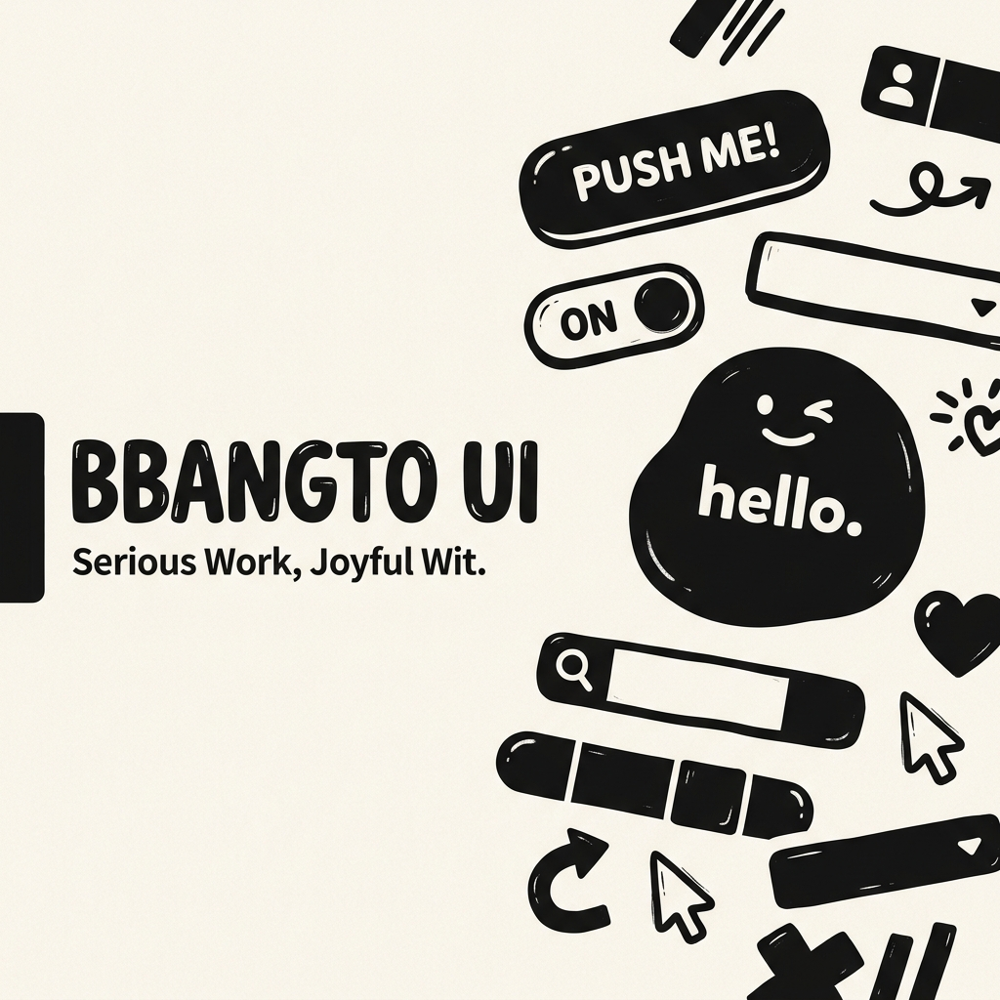

<div align="center">
  
</div>

# BBANGTO UI

> **Serious Work, Joyful Wit.**

BBANGTO UI는 React 디자인 시스템 모노레포입니다. 낱개 컴포넌트부터 페이지 섹션, 모션, 다이어그램까지를 한 벌의 디자인 토큰 위에 올려 두고, 그 위에 입힐 완성된 룩(style guide preset)을 UI 51종 · 시각화 30종 준비해 뒀습니다. 원하는 룩이 없으면 직접 만들어 카탈로그에 등재할 수도 있습니다.

---

## 무엇을 하려고 오셨나요

이 문서는 패키지 목록이 아니라 **사례 목록**으로 짜여 있습니다. 아래 표에서 자기 줄을 찾아 그 사례로 바로 가세요. 사례마다 설치·절차·코드가 처음부터 끝까지 들어 있어서, 다른 문서를 먼저 읽지 않아도 됩니다.

| 하려는 일 | 사례 | 쓰는 패키지 |
|---|---|---|
| 이미 있는 React 앱에 버튼·폼·표를 붙인다 | [1 · 앱에 컴포넌트를 얹는다](#사례-1--앱에-컴포넌트를-얹는다) | `core` |
| 랜딩·마케팅 페이지를 섹션째로 빨리 세운다 | [2 · 페이지 섹션을 통째로 가져다 쓴다](#사례-2--페이지-섹션을-통째로-가져다-쓴다) | `core` |
| 애니메이션 라이브러리 없이 움직임을 붙인다 | [3 · 움직임을 붙인다](#사례-3--움직임을-붙인다) | `core` |
| 기본 색 대신 우리 브랜드 색을 입힌다 | [4 · 브랜드 색으로 갈아입힌다](#사례-4--브랜드-색으로-갈아입힌다) | `core` + `foundations` |
| 디자인 컨셉을 통째로 갈아끼운다 | [5 · 완성된 룩을 골라 입힌다](#사례-5--완성된-룩을-골라-입힌다) | `core` + `style-guide-catalog` |
| **우리만의 룩을 직접 만들어 등재한다** | [6 · 룩을 직접 만든다](#사례-6--룩을-직접-만든다) | `core` + `style-guide-catalog` |
| UI는 자기 것을 쓰고 React 훅만 가져온다 | [7 · 로직만 가져다 쓴다](#사례-7--로직만-가져다-쓴다) | `hooks` |
| 아키텍처 도식·차트를 React로 그린다 | [8 · 다이어그램·인포그래픽을 그린다](#사례-8--다이어그램인포그래픽을-그린다) | `visualization` + `visualization-style-guide-catalog` |
| **도식용 룩을 직접 만들어 등재한다** | [9 · viz 룩을 직접 만든다](#사례-9--viz-룩을-직접-만든다) | `visualization` + `visualization-style-guide-catalog` |
| 이 레포에 컴포넌트나 preset을 넣는다 | [10 · 이 레포에 기여한다](#사례-10--이-레포에-기여한다) | 저장소 전체 |

각 사례는 「그다음」으로 끝납니다. 방금 무엇을 할 수 있게 됐는지 확인하고 다음 사례로 넘어가는 자리예요. 순서대로 읽을 필요는 없고, 자기 줄에서 출발해 필요한 만큼만 따라가면 됩니다.

---

## 시작 전 — 세 가지

사례 어느 쪽으로 가든 아래 셋은 공통입니다. 사례 본문의 설치 블록은 `pnpm add`만 적으니, 처음 한 번은 여기를 보고 넘어가세요.

**1. 레지스트리 설정.** 이 패키지들은 npm 공개 레지스트리가 아니라 GitHub Packages에 올라갑니다. 설정 없이 `pnpm add`를 치면 패키지를 못 찾습니다.

```
# 프로젝트 루트의 .npmrc
@centurio1987:registry=https://npm.pkg.github.com
//npm.pkg.github.com/:_authToken=${GITHUB_TOKEN}
```

`GITHUB_TOKEN`은 `read:packages` 권한이 있는 개인 액세스 토큰입니다.

**2. ESM 전용.** 모든 패키지가 `"type": "module"`이고 CommonJS 산출물이 없습니다. `require()`로는 불러올 수 없어요. 번들러 없이 Node에서 직접 쓸 거라면 `import`만 됩니다.

**3. React 18 또는 19.** peer dependency가 `^18.2.0 || ^19.0.0`입니다. `hooks` 패키지만 예외로 `react` 하나만 요구하고 `react-dom`은 요구하지 않습니다.

---

## 사례

### 사례 1 · 앱에 컴포넌트를 얹는다

이미 돌아가는 React 앱에 버튼, 입력창, 표를 붙이려는 분을 위한 자리예요. 필요한 패키지는 `core` 하나입니다. 디자인 토큰 패키지는 `core`의 `dependencies`에 이미 들어 있어서 따로 설치하지 않아도 같이 딸려 옵니다.

**설치**

```bash
pnpm add @centurio1987/bbangto-ui-core
```

**절차**

1. 앱의 가장 바깥을 `FoundationProvider`로 감쌉니다. 이 컴포넌트가 감싼 엘리먼트에 `--bbangto-*` CSS 커스텀 프로퍼티를 심어 주고, 그 안쪽 컴포넌트들이 그 값을 읽습니다.

   ```tsx
   import { FoundationProvider } from '@centurio1987/bbangto-ui-core';

   export function App() {
     return (
       <FoundationProvider>
         <YourRoutes />
       </FoundationProvider>
     );
   }
   ```

   `foundation` prop을 비워 두면 `lightFoundation`이 들어갑니다. 라이트 테마로 시작하고 싶다면 여기서 더 쓸 것이 없어요.

2. 감싼 안쪽에 컴포넌트를 놓습니다. `Button` 하나면 토큰이 제대로 흐르는지 눈으로 확인됩니다.

   ```tsx
   import { Button } from '@centurio1987/bbangto-ui-core';

   <Button variant="solid" color="primary" size="md">
     저장
   </Button>
   ```

   `variant`는 `solid` · `outline` · `ghost` · `soft` · `gradient` · `link` · `neon` 일곱 가지, `color`는 `primary` · `error` · `success` · `warning` · `neutral` 다섯 가지를 받습니다. 나머지 prop은 `<button>`에 그대로 전달됩니다.

3. 폼 부품을 붙입니다. `Input`은 라벨과 도움말과 오류 문구를 자기가 배치하니, 바깥에 `<label>`을 따로 만들 필요가 없어요.

   ```tsx
   import { Input } from '@centurio1987/bbangto-ui-core';

   <Input label="이메일" helperText="회사 메일 주소를 적어 주세요." fullWidth />
   ```

   입력창 아래 문구 자리는 하나뿐이고 `error` · `success` · `helperText` 순으로 앞선 것이 우선합니다. 오류를 넘기는 동안에는 도움말이 가려집니다.

4. 아이콘이 필요하면 `Icon`으로 끝나는 이름을 그대로 가져다 슬롯에 끼웁니다. 107종이 `core` 배럴에서 바로 나옵니다.

   ```tsx
   import { Input, SearchIcon } from '@centurio1987/bbangto-ui-core';

   <Input label="검색" leftIcon={<SearchIcon width={18} height={18} />} />
   ```

   아이콘은 `React.SVGProps<SVGSVGElement>`를 그대로 받습니다. 기본 크기가 `width="1em"`이라 크기를 안 주면 주변 글자 크기를 따라갑니다.

5. 컴포넌트를 `FoundationProvider` 바깥에 두지 않았는지 확인합니다. 이 규칙이 깨지면 어떻게 되는지 알아 두는 편이 좋아요.

   > **자주 하는 착각** — Provider는 테마를 바꿀 때만 필요한 장식이 아닙니다. 컴포넌트가 쓰는 색은 전부 `var(--bbangto-semantic-primary-base)` 같은 참조이고, 이 변수에는 대체값이 붙어 있지 않아요. Provider 밖에서는 변수가 정의되지 않아 그 선언 자체가 무효가 되고, 브라우저 기본 색으로 그려집니다. 버튼이 회색 맨몸으로 나오면 십중팔구 이 자리입니다.

**더 보기** — [`DESIGN_SYSTEM_GUIDE.md`](DESIGN_SYSTEM_GUIDE.md) (컴포넌트가 어느 계층에 속하는지 가르는 기준표)

**그다음**

이제 낱개 부품으로 화면을 조립할 수 있게 됐습니다. 부품 대신 섹션을 통째로 얹고 싶다면 [사례 2](#사례-2--페이지-섹션을-통째로-가져다-쓴다)로, 기본 색 대신 브랜드 색을 입히고 싶다면 [사례 4](#사례-4--브랜드-색으로-갈아입힌다)로 가세요.

---

### 사례 2 · 페이지 섹션을 통째로 가져다 쓴다

랜딩 페이지나 마케팅 페이지를 빠르게 만들어야 하는 분을 위한 자리예요. `core`에는 섹션 단위로 완성된 블록 13종과 화면 단위로 완성된 패턴 4종이 함께 들어 있습니다. 버튼부터 쌓아 올리는 대신 `Hero` 하나로 첫 화면을 끝낼 수 있습니다.

| 덩어리 | 들어 있는 것 |
|---|---|
| 블록 13종 | `Hero` · `FeatureGrid` · `CTA` · `PricingSection` · `Testimonials` · `LogoCloud` · `Comparison` · `Dock` · `Gallery` · `VideoBlock` · `MapBlock` · `MarketingFooter` · `AnnouncementBar` |
| 패턴 4종 | `SignIn` · `SignUp` · `FormLayout` · `AIChat` |

**설치**

```bash
pnpm add @centurio1987/bbangto-ui-core
```

**절차**

1. 앱 바깥을 `FoundationProvider`로 감쌉니다. 블록도 낱개 컴포넌트와 같은 토큰을 읽으니 이 감싸기는 건너뛸 수 없어요. 코드는 [사례 1의 1번](#사례-1--앱에-컴포넌트를-얹는다)과 같습니다.

2. `Hero`로 첫 화면을 채웁니다. `title`만 필수이고 나머지는 있으면 그리고 없으면 지나갑니다.

   ```tsx
   import { Hero } from '@centurio1987/bbangto-ui-core';

   <Hero
     eyebrow="새 요금제"
     title="필요한 화면을 섹션째로"
     subtitle="블록을 얹으면 첫 화면이 한 번에 끝납니다."
     primaryCta={{ label: '시작하기', onClick: goSignUp }}
     secondaryCta={{ label: '문서 보기', onClick: goDocs }}
     layout="centered"
   />
   ```

   `layout`을 생략하면 `media`를 넘겼는지에 따라 결정됩니다. 미디어가 있으면 `split-media`, 없으면 `centered`로 잡힙니다.

3. `FeatureGrid`로 기능 목록을 깝니다. 항목은 `title`과 `description`이 필수이고 `icon`은 선택입니다.

   ```tsx
   import { FeatureGrid } from '@centurio1987/bbangto-ui-core';

   <FeatureGrid
     title="무엇이 들어 있나"
     items={[
       { title: '컴포넌트', description: '폼과 표를 포함한 낱개 부품' },
       { title: '블록', description: '섹션 단위로 완성된 레이아웃' },
     ]}
     layout="grid"
   />
   ```

4. `PricingSection`으로 요금제를 붙입니다. 요금제 하나는 `name` · `price` · `features` · `cta` 네 자리가 필수이고, `period`와 `highlighted`는 선택입니다.

   ```tsx
   import { PricingSection } from '@centurio1987/bbangto-ui-core';

   <PricingSection
     title="요금제"
     plans={[
       { name: 'Starter', price: 'Free', features: ['컴포넌트 전체'], cta: '시작하기' },
       {
         name: 'Pro',
         price: '$29',
         period: '/ month',
         features: ['우선 지원', '비공개 preset'],
         cta: '업그레이드',
         highlighted: true,
       },
     ]}
     layout="cards"
   />
   ```

5. 로그인 화면이 필요하면 패턴으로 넘어갑니다. 블록이 섹션 하나를 맡는다면 패턴은 화면 하나를 통째로 맡습니다. `SignIn`은 이메일 형식 검사와 오류 문구 배치까지 자기가 합니다.

   ```tsx
   import { SignIn } from '@centurio1987/bbangto-ui-core';

   <SignIn
     onSubmit={({ email, password, remember }) => login(email, password, remember)}
     forgotHref="/forgot"
     signUpHref="/signup"
     layout="centered"
   />
   ```

   `onSubmit`은 필수이고 `Promise`를 돌려줘도 됩니다. 제출 중임을 보이려면 `loading`을, 서버가 준 실패 사유를 띄우려면 `error`를 넘깁니다.

6. `Comparison`을 쓸 계획이라면 import 경로를 한 번 더 봅니다. 같은 이름이 두 패키지에 있고, 둘은 서로 다른 컴포넌트예요.

   ```tsx
   // 마케팅용 비교 섹션 (요금제 대조 같은 것)
   import { Comparison as MarketingComparison } from '@centurio1987/bbangto-ui-core';

   // 비교 도식 (SVG 다이어그램)
   import { Comparison as VizComparison } from '@centurio1987/bbangto-ui-visualization';
   ```

   한 파일에서 둘 다 쓸 일이 생기면 위처럼 `as`로 이름을 갈라 줍니다. 갈라 두지 않으면 같은 이름이 두 번 선언돼 그 자리에서 컴파일이 멈춥니다.

   > **자주 하는 착각** — 자동 완성이 `Comparison`을 하나만 보여 준다고 믿으면 안 됩니다. 편집기가 어느 쪽을 먼저 제안하는지는 그때그때 다르고, `ComparisonProps`도 같은 이름으로 양쪽에 있어 타입 오류가 뜨지 않은 채 전혀 다른 물건이 들어옵니다. 넘긴 prop이 통째로 무시되는 것처럼 보인다면 import 줄부터 확인하세요.

**더 보기** — [`DESIGN_SYSTEM_GUIDE.md`](DESIGN_SYSTEM_GUIDE.md) (블록과 패턴을 가르는 기준)

**그다음**

이제 섹션을 얹어 페이지 한 장을 세울 수 있게 됐습니다. 그 섹션에 등장 애니메이션을 붙이려면 [사례 3](#사례-3--움직임을-붙인다)으로, 페이지 전체의 인상을 다른 디자인 컨셉으로 갈아끼우려면 [사례 5](#사례-5--완성된-룩을-골라-입힌다)로 가세요.

---

### 사례 3 · 움직임을 붙인다

등장 애니메이션은 필요한데 애니메이션 라이브러리를 새로 넣기는 싫은 분을 위한 자리예요. `core`의 `dependencies`에는 디자인 토큰 패키지 하나만 있습니다. framer-motion도 emotion도 들어오지 않고, 움직임은 `@keyframes` 규칙과 CSS 커스텀 프로퍼티만으로 만들어집니다. 쓸 수 있는 것은 모션 atom 25종과 셰이더 배경 10종입니다.

**설치**

```bash
pnpm add @centurio1987/bbangto-ui-core
```

**절차**

1. `FoundationProvider`로 감쌉니다. 모션에서 이 감싸기가 하는 일이 하나 더 있어요. Provider가 `useMotionKeyframes`를 호출해 `<style id="bbangto-motion-keyframes">`를 `document.head`에 딱 한 번 넣습니다. 이 시트 안에 `bbangto-fade-in` 같은 `@keyframes` 규칙 전부가 들어 있습니다.

   ```tsx
   import { FoundationProvider } from '@centurio1987/bbangto-ui-core';

   <FoundationProvider>
     <YourRoutes />
   </FoundationProvider>
   ```

   토큰 계층이 담는 것은 지속 시간과 이징 같은 **값**이고, `@keyframes`는 값이 아니라 규칙이라 CSS 커스텀 프로퍼티에 담기지 않습니다. 그래서 keyframe만 별도 시트로 주입됩니다.

2. `FadeIn`으로 요소 하나를 띄워 봅니다.

   ```tsx
   import { FadeIn } from '@centurio1987/bbangto-ui-core';

   <FadeIn duration="240ms" delay="80ms">
     <ProductCard />
   </FadeIn>
   ```

   `duration`과 `easing`을 비우면 각각 `motion.duration.normal`과 `motion.easing.out` 토큰이 들어갑니다. 값을 직접 적는 순간 그 요소만 토큰에서 떨어져 나오니, 특별한 이유가 없으면 비워 두는 편이 낫습니다.

3. 여러 개를 차례로 등장시키려면 `Stagger`로 감쌉니다. 직계 자식마다 `animation-delay`를 한 칸씩 밀어 줍니다.

   ```tsx
   import { Stagger } from '@centurio1987/bbangto-ui-core';

   <Stagger stagger={80}>
     <Row id="a" />
     <Row id="b" />
     <Row id="c" />
   </Stagger>
   ```

   `stagger`의 단위는 밀리초이고 기본값은 80입니다. 첫 자식의 지연은 0이므로 위 코드의 세 행은 0ms · 80ms · 160ms에 차례로 나타납니다.

4. 방향이 있는 등장이 필요하면 `SlideIn`을 씁니다. 여기가 CSS 커스텀 프로퍼티만으로 어떻게 버티는지 가장 잘 드러나는 자리예요.

   ```tsx
   import { SlideIn } from '@centurio1987/bbangto-ui-core';

   <SlideIn direction="left" distance="24px">
     <Panel />
   </SlideIn>
   ```

   방향이 넷이라고 keyframe이 넷 필요하지는 않습니다. `bbangto-slide-in` 하나가 `--bbangto-slide-x`와 `--bbangto-slide-y`를 읽어 이동량을 정하고, atom이 인스턴스마다 그 변수에 값을 꽂습니다. 변수 이름은 `SLIDE_VARS`로 내보내니 직접 CSS를 쓸 때도 같은 keyframe에 올라탈 수 있습니다.

5. 배경 전체가 움직여야 하면 셰이더 배경 10종에서 고릅니다. `Aurora` · `DotMatrix` · `Halftone` · `MeshGradient` · `Metaballs` · `Noise` · `ParticleField` · `Plasma` · `RippleBg` · `Waves` 가 있습니다.

   ```tsx
   import { Aurora, Hero } from '@centurio1987/bbangto-ui-core';

   <div style={{ position: 'relative' }}>
     <Aurora speed={1} style={{ position: 'absolute', inset: 0 }} />
     <Hero title="필요한 화면을 섹션째로" />
   </div>
   ```

   셰이더 배경은 앞의 atom들과 구현이 다릅니다. `<canvas>` 위에 매 프레임 다시 그리는 방식이고, 컨테이너와 캔버스 양쪽에 `aria-hidden`이 붙어 보조기술에는 잡히지 않아요. `static`을 켜면 프레임 루프 없이 정지 화면 한 장만 그립니다. 사용자 쪽에 감축 모션 설정이 켜져 있어도 같은 정지 화면으로 떨어집니다.

6. 접근성 처리를 확인합니다. 1번에서 주입된 시트에는 keyframe 말고 감축 모션 규칙도 함께 들어 있습니다.

   ```css
   @media (prefers-reduced-motion: reduce) {
     [data-bbangto-foundation] *:not([data-bbangto-motion="essential"]),
     [data-bbangto-foundation] *:not([data-bbangto-motion="essential"])::before,
     [data-bbangto-foundation] *:not([data-bbangto-motion="essential"])::after {
       animation-duration: 0.01ms !important;
       animation-iteration-count: 1 !important;
       transition-duration: 0.01ms !important;
       scroll-behavior: auto !important;
     }
   }
   ```

   선택자가 `[data-bbangto-foundation]`으로 시작하는 점을 보세요. 이 속성은 `FoundationProvider`가 자기 wrapper에 붙이므로, 규칙이 닿는 범위는 디자인 시스템이 감싼 영역 안쪽뿐입니다. 같은 페이지에 있는 여러분 자신의 애니메이션은 건드리지 않습니다.

7. 멈추면 안 되는 움직임에는 예외 표시를 답니다. 진행 상황을 알리는 움직임까지 정지시키면 화면이 멈춘 것인지 로딩 중인지 구분할 수 없게 되니까요.

   ```tsx
   <div data-bbangto-motion="essential">
     <UploadProgressRing />
   </div>
   ```

   `Spinner`에는 이 속성이 이미 붙어 있어 감축 모션에서도 계속 돕니다. 직접 만든 진행 표시에는 위처럼 손으로 달아 주세요.

**더 보기** — [`packages/core/motion-catalog.md`](packages/core/motion-catalog.md) (atom 25종의 SSOT), [`packages/core/MOTION_QUALITY_CHECKLIST.md`](packages/core/MOTION_QUALITY_CHECKLIST.md)

**그다음**

이제 라이브러리를 하나도 더 넣지 않고 등장 애니메이션과 배경 움직임을 붙일 수 있게 됐습니다. 움직임을 얹을 컴포넌트 자체가 아직 없다면 [사례 1](#사례-1--앱에-컴포넌트를-얹는다)로, 움직임까지 포함해 디자인 컨셉을 통째로 고르고 싶다면 [사례 5](#사례-5--완성된-룩을-골라-입힌다)로 가세요.

---

### 사례 4 · 브랜드 색으로 갈아입힌다

컴포넌트는 마음에 드는데 색이 자기 브랜드가 아닌 사람을 위한 자리입니다. 색만 갈아입히는 일은 컴포넌트를 다시 쓰는 일이 아니에요. `FoundationProvider`에 넘기는 foundation 객체 하나만 바꾸면 그 아래 모든 컴포넌트가 새 색으로 다시 그려집니다.

고를 수 있는 색은 두 군데에 나뉘어 있습니다. 기본 3종(`lightFoundation`·`darkFoundation`·`highContrastFoundation`)은 core 안에 들어 있고, 확장 76종은 별도 패키지입니다. 76은 amber 2종에 브랜드 프리셋 74종을 더한 수이고, 근거는 `packages/foundations/foundation.manifest.json`의 항목 수입니다.

**설치**

```bash
pnpm add @centurio1987/bbangto-ui-core @centurio1987/bbangto-ui-foundations
```

**절차**

1. 쓰고 싶은 foundation을 이름으로 직접 import 해서 Provider에 넘깁니다.

   ```tsx
   import { FoundationProvider, Button } from '@centurio1987/bbangto-ui-core';
   import { coralFoundation } from '@centurio1987/bbangto-ui-foundations';

   export function App() {
     return (
       <FoundationProvider foundation={coralFoundation}>
         <Button>주문하기</Button>
       </FoundationProvider>
     );
   }
   ```

2. 색이 정말 위에서 내려오는지 확인합니다. `foundation={coralFoundation}`의 값을 `lightFoundation`으로 바꿔 보세요. 같은 `Button`이 기본 라이트 색으로 돌아옵니다. `Button`을 감싼 코드도, `Button`에 준 prop도 그대로인데 화면 색만 바뀌었다면 제대로 연결된 것입니다.

   > 컴포넌트를 고치는 게 아니라 컴포넌트 위의 한 줄을 고칩니다.

3. 76종의 이름을 아직 모르는 단계라면 `foundationCatalog`로 슬러그를 찍어 볼 수 있습니다. 다만 여기에 조심할 점이 하나 있어요.

   ```ts
   import { foundationCatalog } from '@centurio1987/bbangto-ui-foundations';

   const coral = foundationCatalog['coral'];
   ```

   `foundationCatalog`의 타입은 `Record<string, BbangtoFoundation>`입니다. 키가 리터럴 유니온이 아니라서 편집기 자동완성이 뜨지 않고, 오타도 컴파일 단계에서 잡히지 않아요. `foundationCatalog['corl']`이라고 써도 타입 검사는 통과하고, 대신 런타임에 `undefined`가 Provider로 들어갑니다. 그러면 에러 없이 앱이 뜨는데 색만 안 바뀐 상태가 되고, 원인을 찾기까지 한참 걸립니다. 그래서 실제 코드에는 1번의 직접 import를 쓰고, 이 조회는 탐색용으로만 씁니다.

4. 조건을 주고 후보를 추리고 싶다면 `foundations/meta` 서브패스를 씁니다.

   ```ts
   import { foundationCatalog } from '@centurio1987/bbangto-ui-foundations';
   import {
     buildFoundationManifest,
     foundationMetaRegistry,
     selectFoundations,
   } from '@centurio1987/bbangto-ui-foundations/meta';

   const manifest = buildFoundationManifest(foundationCatalog, foundationMetaRegistry);
   const picks = selectFoundations(manifest, {
     colorScheme: 'light',
     domains: ['saas'],
     limit: 3,
   });

   // picks[0].slug 로 foundationCatalog[picks[0].slug] 를 꺼낸다
   ```

   이 네 심볼은 메인 배럴에 없습니다. `@centurio1987/bbangto-ui-foundations/meta`로만 닿아요. 점수를 어떻게 매기는지와 메타 필드가 무엇을 뜻하는지는 `packages/foundations/FOUNDATION_METADATA_STRATEGY.md`에 있습니다.

**더 보기** — [`packages/foundations/FOUNDATION_METADATA_STRATEGY.md`](packages/foundations/FOUNDATION_METADATA_STRATEGY.md) (메타 필드와 스코어링)

**그다음**

색은 브랜드 것이 됐지만 모서리·그림자·타이포는 아직 기본값입니다. 룩 전체를 통째로 바꾸려면 [사례 5](#사례-5--완성된-룩을-골라-입힌다), 76종에 원하는 색이 없어 직접 만들려면 [사례 6](#사례-6--룩을-직접-만든다)로 갑니다.

---

### 사례 5 · 완성된 룩을 골라 입힌다

색 하나가 아니라 모서리·그림자·타이포·래퍼까지 한 덩어리로 갈아끼우고 싶을 때 쓰는 방법입니다. 그 덩어리를 style guide preset이라고 부르고, 지금 51종이 있습니다. 51이라는 수의 근거는 `packages/style-guide-catalog/catalog.manifest.json`의 항목 수예요. 문서보다 매니페스트가 항상 최신이니 정확한 목록이 필요하면 그 파일을 보세요.

**설치**

```bash
pnpm add @centurio1987/bbangto-ui-core @centurio1987/bbangto-ui-style-guide-catalog
```

카탈로그 패키지가 core를 dependency로 갖고 있지만, 위 코드에서 `StyleGuideProvider`와 `Button`을 core에서 직접 import 하므로 core도 명시해서 설치합니다.

**절차**

1. preset 하나를 골라 `StyleGuideProvider`에 꽂습니다.

   ```tsx
   import { StyleGuideProvider, Button } from '@centurio1987/bbangto-ui-core';
   import { neobrutalismEditorialStyleGuide } from '@centurio1987/bbangto-ui-style-guide-catalog';

   export function App() {
     return (
       <StyleGuideProvider styleGuide={neobrutalismEditorialStyleGuide}>
         <Button>주문하기</Button>
       </StyleGuideProvider>
     );
   }
   ```

   `styleGuide`는 필수 prop입니다. 사례 4의 `FoundationProvider`는 `foundation`을 생략하면 `lightFoundation`으로 떨어지지만, 이쪽에는 그런 기본값이 없어요. 빼먹으면 타입 검사에서 막힙니다.

2. 같은 preset 안에서 색 변주만 바꾸려면 `foundationKey`를 붙입니다.

   ```tsx
   <StyleGuideProvider
     styleGuide={neobrutalismEditorialStyleGuide}
     foundationKey="midnight"
   >
   ```

   쓸 수 있는 키는 preset 자신이 갖고 있습니다. `neobrutalismEditorialStyleGuide.foundationPresets`의 각 항목이 `key`를 들고 있고, `neobrutalism-editorial-01`의 경우 `default`·`midnight`·`berry` 셋입니다. `foundationKey`를 생략하면 그 preset의 `defaultFoundationKey`가 쓰입니다.

3. 51종 중에서 조건에 맞는 것을 추리려면 `selectStyleGuides`를 씁니다.

   ```ts
   import {
     styleGuideCatalog,
     selectStyleGuides,
   } from '@centurio1987/bbangto-ui-style-guide-catalog';

   const picks = selectStyleGuides(styleGuideCatalog, {
     family: 'structural-raw',
     domains: ['portfolio', 'marketing'],
     limit: 3,
   });

   // picks[0].entry 가 StyleGuide 그대로라서 styleGuide prop 에 바로 넘길 수 있다
   ```

   import 줄의 패키지명을 한 번 더 확인하세요. `selectStyleGuides`라는 이름은 UI 카탈로그와 viz 카탈로그 양쪽에 있고, 이름만 같지 타입이 다릅니다. 여기서 필요한 것은 `@centurio1987/bbangto-ui-style-guide-catalog` 쪽입니다.

4. 슬러그 문자열로 꺼내는 `styleGuideMap`은 마지막 수단으로 남겨 두세요. 이유가 둘입니다.

   하나는 타입입니다. `styleGuideMap` 역시 `Record<string, StyleGuide>`라서 사례 4의 `foundationCatalog`와 같은 문제를 그대로 갖습니다. 오타가 `undefined`로 조용히 넘어갑니다.

   다른 하나는 이름입니다. 슬러그 다섯 개가 UI와 viz 두 매니페스트에 동시에 있습니다. `artdeco-luxe-01`, `bauhaus-geometric-01`, `blueprint-technical-01`, `kawaii-pastel-01`, `retro70s-warm-01`이 그것입니다. `styleGuideMap['blueprint-technical-01']`과 `vizStyleGuideMap['blueprint-technical-01']`은 이름이 같을 뿐 서로 다른 물건이에요. 앞쪽은 UI 컴포넌트용 `StyleGuide`이고 뒤쪽은 SVG 도식용 `VisualizationStyleGuide`라서, 담고 있는 토큰도 래퍼도 다릅니다. viz 쪽은 `StyleGuideProvider`가 아니라 `VisualizationStyleGuideProvider`에 넣는 물건입니다.

   preset 변수명을 머릿속에서 만들어 쓰는 것도 같은 사고로 이어집니다. 두 카탈로그의 이름 규칙이 서로 반대예요.

   > 표시명 끝의 `_01`을 UI는 떼고, viz는 남깁니다.

   그래서 `Neobrutalism_Editorial_01`은 `neobrutalismEditorialStyleGuide`가 되고, `blueprint-technical-01`은 `blueprintTechnical01VizStyleGuide`가 됩니다. 대소문자도 갈립니다. 같은 아르데코가 UI에서는 `artDecoLuxeStyleGuide`(대문자 D), viz에서는 `artdecoLuxe01VizStyleGuide`(소문자 d)입니다. 이름은 유추하지 말고 `packages/style-guide-catalog/README.md`의 목록에서 확인하세요.

**더 보기** — [`packages/style-guide-catalog/README.md`](packages/style-guide-catalog/README.md) (51종 목록), [`packages/core/style-guide-catalog.md`](packages/core/style-guide-catalog.md) (6요소 스키마와 명명 규칙)

**그다음**

Provider 한 줄로 앱 전체 룩이 바뀌는 것까지 확인했습니다. 51종에 원하는 것이 없으면 [사례 6](#사례-6--룩을-직접-만든다)에서 직접 만들고, 같은 룩을 도식과 차트까지 끌고 가려면 [사례 8](#사례-8--다이어그램인포그래픽을-그린다)로 갑니다.

---

### 사례 6 · 룩을 직접 만든다

카탈로그 51종(`packages/style-guide-catalog/catalog.manifest.json` 실측)을 다 넘겨봤는데 원하는 인상이 없을 때 오는 자리입니다. 여기서 만드는 것은 색 몇 개를 바꾼 테마가 아니라 preset 하나입니다. 색·타이포·모서리·그림자를 정하고, Button/Card/Tag가 그 문법대로 보이게 감싸고, 카탈로그에 등재하는 데까지가 한 벌입니다.

```
makeSemantic(색 17개) ──┐
                        ├─→ makeFoundations ─→ foundations ──┐
radius · shadow · 폰트 ──┘                                    │
                                                              ├─→ StyleGuide ─→ StyleGuideProvider
makeMotifWrappers(css) ─→ wrapperComponents ──────────────────┤
makeShowcase(copy) ────→ patterns / visualMotif.example ──────┘
```

**설치**

```bash
pnpm add @centurio1987/bbangto-ui-core @centurio1987/bbangto-ui-style-guide-catalog
```

저작 헬퍼(`makeSemantic` 계열)는 카탈로그 패키지에 있고, `StyleGuide`·`VisualMotif` 타입과 `StyleGuideProvider`는 core에 있습니다. `tokens`는 core의 dependency라 따로 설치하지 않습니다. 레지스트리 설정이 아직이면 「시작 전」 절을 먼저 보세요.

**절차**

1. **이름을 먼저 정합니다.** 표시명과 slug 두 개를 씁니다. 표시명은 `<PrimaryTrend>_<SecondaryModifier>_NN` 형태로, PascalCase 단어를 `_`로 잇고 인덱스 접미사로 끝냅니다. slug은 그 소문자 kebab-case 입니다.

   ```ts
   // 표시명: Coastal_Grid_01      → meta.displayName
   // slug:   coastal-grid-01      → StyleGuide.name · styleGuideMap 키 · data-bbangto-style-guide 값
   ```

   접미사를 `_03`처럼 다른 번호로 두면 `packages/style-guide-catalog/src/displayName.test.ts`의 정규식 `^[A-Z][A-Za-z0-9]*(?:_[A-Za-z0-9]+)*_01$`에 걸려 테스트가 빨개집니다. 이미지 마이닝으로 도출한 16종이 한때 마이닝 순번을 그대로 달고 있었고, 그 재발을 막으려고 세워 둔 게이트입니다.

2. **`makeSemantic`으로 색 17개를 semantic 트리로 폅니다.** 배경 4 · 전경 4 · 보더 4 · primary 5가 필수 입력입니다.

   ```ts
   import { makeSemantic } from '@centurio1987/bbangto-ui-style-guide-catalog';

   const semantic = makeSemantic({
     bg: '#F4F7F8', bgElevated: '#FFFFFF', bgSunken: '#E4EBED', overlay: 'rgba(18,32,38,0.55)',
     fg: '#122026', fgMuted: '#3C4C53', fgSubtle: '#6B7B82', fgInverse: '#F4F7F8',
     border: '#122026', borderMuted: '#9FB0B6', borderStrong: '#122026', focus: '#1E8FA8',
     primaryBase: '#12525F', primaryHover: '#0E434E', primaryActive: '#0A343D',
     primarySubtle: '#CBE3E8', primaryFg: '#F4F7F8',
     accent: '#1E8FA8', accent2: '#C8A44D', accent3: '#8FB0A0',
   });
   ```

   `error`·`success`·`warning`·`disabled`·`category`와 `accent` 3형제는 선택입니다. 앞의 다섯은 표준 상태색 기본값이 이미 채워져 있어 비워도 돼요. `accent`는 성격이 다릅니다. `packages/style-guide-catalog/src/_foundation.ts:102`가 이렇게 폴백합니다.

   ```ts
   const a1 = i.accent ?? i.primaryBase;
   ```

   그래서 `accent`를 비우면 카테고리 색 여덟 자리가 전부 primary 색으로 채워집니다. 타입 에러도 경고도 없고, Tag의 accent tone이 primary 버튼과 같은 색으로 나와 둘의 구분이 화면에서 사라집니다.

3. **`makeFoundations`로 `BbangtoFoundation`을 만듭니다.** spacing · motion · zIndex · palette 스캐폴드는 헬퍼가 채우고, preset마다 실제로 갈리는 값만 넘깁니다.

   ```ts
   import { makeFoundations } from '@centurio1987/bbangto-ui-style-guide-catalog';

   const foundations = makeFoundations({
     name: 'coastal-grid-01',              // slug을 그대로 쓴다
     description: '해안 그리드 — 옅은 물빛 캔버스에 1px 잉크선과 얕은 그림자',
     semantic,
     fontSans: "'IBM Plex Sans KR', sans-serif",
     fontMono: "'IBM Plex Mono', monospace",
     radius: { none: '0px', sm: '2px', md: '4px', lg: '8px', xl: '12px', full: '9999px' },
     shadow: {
       none: 'none',
       sm: '0 1px 2px rgba(18,32,38,0.10)',
       md: '0 2px 6px rgba(18,32,38,0.12)',
       lg: '0 6px 16px rgba(18,32,38,0.14)',
       xl: '0 12px 32px rgba(18,32,38,0.16)',
     },
     typeScale: { h1: { fontSize: '44px', lineHeight: '1.05', letterSpacing: '-0.01em', fontWeight: 700 } },
     neutral: { 0: '#0A1114', 50: '#6B7B82', 95: '#F4F7F8', 100: '#FFFFFF' },
   });
   ```

   `typeScale`과 `neutral`은 부분 덮어쓰기입니다. 적지 않은 항목은 공통 기본값이 그대로 남습니다.

4. **색 변주가 필요하면 `makeColorway`로 만들어 `foundationPresets`에 답니다.** 같은 모티프 위에서 색 스킴만 갈아끼우는 자리입니다.

   ```ts
   import { makeColorway } from '@centurio1987/bbangto-ui-style-guide-catalog';

   const nightFoundations = makeColorway(foundations, {
     name: 'coastal-grid-01-night',
     description: '해안 그리드 나이트 — 심해 캔버스에 물빛 잉크선',
     semantic: makeSemantic({ /* 색만 다시 적는다 */ }),
   });

   const foundationPresets = [
     { key: 'default', label: '기본 (라이트)', foundations, extendedFoundations },
     { key: 'night', label: '나이트 (다크)', foundations: nightFoundations, extendedFoundations: nightExt },
   ];
   ```

   첫 항목의 `foundations`는 base와 **같은 객체**를 가리키게 둡니다. 그래야 base와 default preset이 갈라지지 않습니다.

   `makeColorway` 대신 `makeFoundations`를 한 번 더 부르면 radius·shadow·typeScale을 손으로 다시 적게 돼요. 그러다 다크 쪽 `radius.md`만 4px에서 6px로 어긋나도 잡아 줄 게이트가 없습니다. 같은 style guide인데 색 스킴을 바꾸면 모서리가 달라지는 상태로 조용히 남죠. 아무도 모릅니다. `makeColorway`는 비색상 토큰을 base에서 그대로 복사하므로 그 어긋남이 애초에 생기지 않습니다.

   `key`는 Provider가 `data-bbangto-foundation` 속성으로 내보냅니다. 없는 key를 넘기면 개발 모드에서 `console.warn` 후 기본 preset으로 폴백합니다.

5. **`makeMotifWrappers`로 Button/Card/Tag를 감쌉니다.** 원형 컴포넌트에 모티프 className을 덧대고 스타일시트를 문서에 1회 주입하는 구조입니다.

   ```tsx
   import { makeMotifWrappers } from '@centurio1987/bbangto-ui-style-guide-catalog';

   const STYLE_ID = 'bbangto-coastal-grid-01-motif';   // slug을 넣어 유일하게 만든다
   const CSS = `
   .bbangto-coastal-btn {
     border: 1px solid var(--bbangto-ext-ink, #122026) !important;
     border-radius: var(--bbangto-radius-md, 4px) !important;
   }
   .bbangto-coastal-card { border: 1px solid var(--bbangto-ext-ink, #122026) !important; }
   `;

   const wrapperComponents = makeMotifWrappers({
     styleId: STYLE_ID,
     css: CSS,
     buttonClass: 'bbangto-coastal-btn',
     cardClass: 'bbangto-coastal-card',
     displayPrefix: 'Coastal',            // → CoastalButton / CoastalCard / CoastalTag
     tag: {
       defaultTone: 'accent',
       baseStyle: { display: 'inline-flex', alignItems: 'center', gap: 6, padding: '2px 8px', fontSize: 10 },
       tones: {
         accent: { background: 'var(--bbangto-ext-accent, #1E8FA8)', color: '#F4F7F8' },
         muted: { background: 'var(--bbangto-semantic-background-elevated, #FFFFFF)', color: '#122026' },
         solid: { background: 'var(--bbangto-ext-ink, #122026)', color: '#F4F7F8' },
       },
     },
   });
   ```

   `makeMotifWrappers`가 내부에서 `useMotifStyle(styleId, css)`를 호출합니다. 직접 만든 래퍼에 CSS를 붙일 때만 `useMotifStyle`을 따로 부르면 됩니다. className을 합칠 일이 있으면 같은 패키지의 `cx`를 씁니다.

   깨지는 자리가 둘 있습니다.

   - `styleId`를 다른 preset과 같은 값으로 두면 두 번째 CSS가 아예 주입되지 않습니다. `useMotifStyle`은 같은 id가 이미 문서에 있으면 그대로 반환하거든요. 화면에는 먼저 주입된 preset의 모양이 남고 에러는 나지 않습니다. slug을 넣어 `bbangto-<slug>-motif`로 두면 겹치지 않습니다.
   - `tones`에서 `muted`를 빠뜨리면 `cfg.tag.tones[tone] ?? {}`가 빈 객체를 넘겨 `baseStyle`만 적용돼요. 타입이 `Record<string, CSSProperties>`라 컴파일은 통과하고, muted 태그만 조용히 배경 없이 렌더됩니다. 표준 tone 세 개(`accent`·`muted`·`solid`)를 모두 채우세요. `makeShowcase`가 이 세 이름으로 태그를 그립니다.

6. **`StyleGuide` 객체로 조립합니다.** 필수는 `name`과 `foundations` 둘뿐이고, core가 얹는 다섯 자리는 전부 선택입니다.

   ```ts
   import type { StyleGuide, VisualMotif } from '@centurio1987/bbangto-ui-core';
   import { makeShowcase, type ShowcaseCopy } from '@centurio1987/bbangto-ui-style-guide-catalog';

   const copy: ShowcaseCopy = {
     badge: 'COASTAL', title: '조수', tagline: '밀물과 썰물의 눈금으로 화면을 잽니다',
     body: '...', ctaPrimary: '눈금 보기', ctaSecondary: '설계 노트',
     bandTitle: '오늘의 수위를 확인하세요',
     items: [
       { name: '수위계', tone: 'accent', tag: 'GAUGE', desc: '...' },
       { name: '조위표', tone: 'muted', tag: 'TABLE', desc: '...' },
       { name: '방파제', tone: 'solid', tag: 'GUARD', desc: '...' },
     ],
   };
   const Showcase = makeShowcase(wrapperComponents, copy, 'CoastalShowcase');

   const visualMotif: VisualMotif = {
     summary: '옅은 물빛 캔버스 위 1px 잉크선과 얕은 그림자.',
     components: {
       Button: { description: '...', specs: ['테두리: 1px 잉크 실선', '모서리: radius md(4px)'] },
     },
     example: Showcase,
   };

   export const CoastalShowcase = Showcase;
   export const coastalGridWrappers = wrapperComponents;

   export const coastalGridStyleGuide: StyleGuide = {
     name: 'coastal-grid-01',
     description: foundations.description,
     foundations,
     extendedFoundations,          // --bbangto-ext-* 네임스페이스
     foundationPresets,
     defaultFoundationKey: 'default',
     wrapperComponents,            // 선택 · useWrapperComponent가 resolve
     patterns: { CoastalShowcase: Showcase },
     guidelines,                   // Record<string, Record<string, unknown>>
     visualMotif,
     meta: { displayName: 'Coastal_Grid_01', family: 'flat-systematic', /* … */ },
   };
   ```

   나머지 선택 자리는 `wrapperBlocks`(Hero 같은 섹션 단위)와 `wrapperPatterns`(SignIn 같은 화면 단위)입니다. 각각 `useWrapperBlock`·`useWrapperPattern`이 읽습니다.

   `makeShowcase`의 세 번째 인자는 표시용 이름이자 `SHOWCASE_COPY_EXT` 조회 키입니다. 등록되지 않은 이름을 주면 확장 카피가 비어 기본값으로 렌더돼요. 섹션 제목이 '구성 요소'로, 연락처가 `hello [at] example.invalid`로 나옵니다. 빌드는 초록입니다. 화면만 밋밋해지므로 눈으로 열어 보기 전에는 알 방법이 없어요.

   기존 preset의 Showcase를 참조할 일이 있으면 이름을 유추하지 마세요. 축약형이라 규칙이 없습니다. `maximalismDopamineStyleGuide`의 짝은 `MaxShowcase`이고 `frutigerAeroGlossyStyleGuide`의 짝은 `AeroShowcase`입니다. `packages/style-guide-catalog/src/index.ts`에서 실제 이름을 확인하고 쓰세요.

7. **`StyleGuideProvider`에 꽂아 동작을 확인합니다.**

   ```tsx
   import { StyleGuideProvider, useWrapperComponent, Button, type ButtonProps } from '@centurio1987/bbangto-ui-core';
   import { coastalGridStyleGuide } from './coastalGrid';

   function ThemedButton(props: ButtonProps) {
     const Themed = useWrapperComponent('Button', Button);
     return <Themed {...props} />;
   }

   export function App() {
     return (
       <StyleGuideProvider styleGuide={coastalGridStyleGuide} foundationKey="night">
         <ThemedButton color="primary">눈금 보기</ThemedButton>
       </StyleGuideProvider>
     );
   }
   ```

   `styleGuide`는 필수 prop이고 `foundationKey`는 선택입니다. 확인할 자리는 세 개입니다. 감싼 엘리먼트에 `data-bbangto-style-guide="coastal-grid-01"`이 붙었는지, `data-bbangto-foundation="night"`가 붙었는지, 그리고 색이 `--bbangto-semantic-*` 변수로 내려왔는지 봅니다.

   `wrapperComponents`의 키를 `button`처럼 소문자로 적으면 `useWrapperComponent('Button', Button)`이 찾지 못해 원형 `Button`으로 폴백합니다. 폴백은 설계된 동작이라 경고가 없어요. 모티프 CSS가 통째로 안 보이는데 화면은 멀쩡히 그려지므로, 그림자가 안 보이는 이유를 CSS에서 찾다가 시간을 씁니다. 키는 컴포넌트 이름 그대로 씁니다.

8. **대비 게이트를 통과시킵니다.** `meta.accessibility.contrastIntent`에 `'aa'`나 `'aaa'`를 적으면 감사가 실측과 대조합니다.

   ```ts
   import { auditContrast, CONTRAST_THRESHOLDS } from '@centurio1987/bbangto-ui-style-guide-catalog';

   CONTRAST_THRESHOLDS;                       // { low: 0, aa: 4.5, aaa: 7 }
   auditContrast([coastalGridStyleGuide]);    // [] 이면 통과
   ```

   검사 대상은 각 foundationPreset의 `semantic.foreground.base` 대 `semantic.background.base`입니다. 배경이 그라디언트면 모든 색 스톱 중 가장 낮은 대비로 판정합니다. 텍스트는 어느 스톱 위에서도 읽혀야 하기 때문입니다.

   `contrastIntent: 'aaa'`로 선언해 두고 본문색 `#767676`을 흰 배경에 올리면 실측이 약 4.54:1 입니다. 7:1에 못 미치므로 `auditContrast`가 `{ reason: 'below-threshold', measured: 4.54 }`를 돌려주고, `packages/style-guide-catalog/src/accessibility.test.ts`의 카탈로그 게이트가 빨개져요. 같은 색으로 `'low'`를 선언하면 통과합니다. 이 감사가 막는 것은 낮은 대비가 아니라 낮은 대비를 높다고 적는 것입니다.

   전경색에 `var(--x)` 같은 값을 넣으면 측정이 안 됩니다. 이때 조용히 넘어가지 않고 `unparseable-foreground` 위반으로 올라옵니다. 게이트가 소리 없이 비는 상태를 막는 장치입니다.

   ```bash
   pnpm --filter @centurio1987/bbangto-ui-style-guide-catalog test
   ```

9. **카탈로그 배럴에 등재합니다.** `export` 한 줄만 추가하면 끝이라고 보기 쉬운데, `packages/style-guide-catalog/src/index.ts`에는 손댈 자리가 셋입니다.

   ```ts
   // (1) 공개 export — preset · Showcase · Wrappers 세 개를 함께
   export { coastalGridStyleGuide, CoastalShowcase, coastalGridWrappers } from './coastalGrid';

   // (2) 카탈로그 배열에 넣기 위한 import
   import { coastalGridStyleGuide } from './coastalGrid';

   // (3) styleGuideCatalog 배열에 추가 — styleGuideMap은 이 배열에서 파생된다
   export const styleGuideCatalog: readonly StyleGuide[] = [ /* … */, coastalGridStyleGuide ];
   ```

   그다음 빌드하면 매니페스트가 갱신됩니다.

   ```bash
   pnpm --filter @centurio1987/bbangto-ui-style-guide-catalog build
   ```

   이 패키지의 `prebuild`가 `gen:manifest`를 돌려 `catalog.manifest.json`을 다시 씁니다. 생성된 JSON은 커밋 대상입니다.

   (3)을 빠뜨렸을 때 무슨 일이 벌어지는지가 이 단계의 핵심입니다. 매니페스트는 51건 그대로고, `styleGuideMap['coastal-grid-01']`은 `undefined`를 돌려줍니다. 이 맵이 `Record<string, StyleGuide>`라 타입 에러도 안 나요. 채택 API `selectStyleGuides`도 후보에서 못 봅니다. 코드는 다 썼는데 카탈로그에 없는 상태가 되고, 무엇을 빠뜨렸는지 알려 주는 메시지가 없습니다.

   한 가지 안전망은 있습니다. `meta.related`에 카탈로그에 없는 슬러그를 적으면 `buildManifest`가 `not in catalog`로 예외를 던져요. self-reference와 중복도 같이 막습니다. 기존 preset의 `related`에 새 슬러그를 먼저 걸어 두면, (3)을 잊었을 때 빌드가 그 자리에서 멈춰 줍니다.

   커밋된 JSON과 재생성 결과가 바이트 단위로 같아야 한다는 테스트도 따로 있습니다. 그 테스트는 `pnpm test`가 아니라 `pnpm test:unit`에서 돕니다.

> 이름 둘, 색 한 벌, 래퍼 셋, 게이트 둘. 이 순서로 세어 보면 빠진 자리가 바로 드러납니다.

**더 보기** — [`packages/core/style-guide-catalog.md`](packages/core/style-guide-catalog.md) (6요소 스키마와 명명 규칙), [`packages/style-guide-catalog/README.md`](packages/style-guide-catalog/README.md), [`packages/style-guide-catalog/METADATA_STRATEGY.md`](packages/style-guide-catalog/METADATA_STRATEGY.md) (`meta` 통제 어휘)

**그다음**

이제 자기 preset을 `StyleGuideProvider`에 꽂아 앱 전체를 갈아입힐 수 있습니다. 감싼 엘리먼트에 `data-bbangto-style-guide`가 자기 slug으로 찍혀 있으면 제대로 붙은 것이고, 이 preset을 이 레포에 올릴 생각이면 [사례 10](#사례-10--이-레포에-기여한다)으로 가세요.

---

### 사례 7 · 로직만 가져다 쓴다

UI는 이미 자기 것이 있고 디바운스나 화면 크기 감지 같은 로직만 필요한 경우가 있습니다. 그런 사람에게 디자인 시스템 전체를 설치하라고 하면 안 되겠죠. 훅 패키지는 peer dependency가 react 하나뿐이라 core 없이 단독으로 씁니다. 훅은 30종이고, 타입 5종이 함께 나옵니다.

**설치**

```bash
pnpm add @centurio1987/bbangto-ui-hooks
```

**절차**

1. 필요한 훅만 import 합니다. 검색 입력을 늦추는 `useDebounce`가 가장 흔한 시작점입니다.

   ```tsx
   import { useEffect, useState } from 'react';
   import { useDebounce } from '@centurio1987/bbangto-ui-hooks';

   export function SearchBox({ onSearch }: { onSearch: (q: string) => void }) {
     const [query, setQuery] = useState('');
     const debounced = useDebounce(query, 300);

     useEffect(() => {
       onSearch(debounced);
     }, [debounced, onSearch]);

     return <input value={query} onChange={(e) => setQuery(e.target.value)} />;
   }
   ```

   `useDebounce(query, 300)`은 값이 바뀔 때마다 타이머를 다시 겁니다. 그래서 타자를 치는 동안에는 `debounced`가 그대로 있다가, 마지막 입력에서 300밀리초가 지나야 한 번 바뀝니다. 글자 수만큼 검색이 나가는 대신 한 번만 나가는 이유가 이것입니다.

2. 브라우저 API를 읽는 훅은 서버 렌더링에서 어떻게 시작하는지 보고 씁니다.

   ```tsx
   import { useMediaQuery } from '@centurio1987/bbangto-ui-hooks';

   const isMobile = useMediaQuery('(max-width: 768px)');
   ```

   `useMediaQuery`는 `window`가 없는 환경에서 `false`로 시작하고, 클라이언트에서 마운트된 뒤 실제 값으로 맞춥니다. 서버가 그린 첫 화면은 언제나 데스크톱 분기라는 뜻이에요. 모바일에서 접속하면 데스크톱 레이아웃이 잠깐 보였다가 바뀝니다. 첫 화면부터 모바일이어야 하는 페이지라면 이 훅만으로는 부족하고, 서버 쪽 User-Agent 판별 같은 다른 수단을 함께 써야 합니다.

3. 훅이 돌려주는 구조체에는 이름 붙은 타입이 있으니 그대로 가져다 씁니다.

   ```ts
   import { useWindowSize, type WindowSize } from '@centurio1987/bbangto-ui-hooks';
   ```

   이렇게 공개된 타입이 `ElementSize`·`FullscreenControls`·`GeolocationState`·`OrientationType`·`WindowSize` 다섯입니다. 훅 30종에 이 다섯을 더한 35개가 이 패키지가 내보내는 전부예요.

**그다음**

react만 설치된 프로젝트에서도 훅 30종이 그대로 돕니다. 나중에 UI 부품까지 필요해지면 [사례 1](#사례-1--앱에-컴포넌트를-얹는다)에서 core를 얹으면 되고, 그때도 이 훅 코드는 손댈 필요가 없습니다.

---

### 사례 8 · 다이어그램·인포그래픽을 그린다

아키텍처 도식이나 차트를 React 컴포넌트로 그리려는 분을 위한 자리입니다. `@centurio1987/bbangto-ui-visualization`은 headless라서 컴포넌트가 내놓는 것은 구조(geometry)뿐이에요. 색·서체·선 굵기는 스타일 가이드를 주입한 뒤에야 정해집니다.

```
Flowchart · BarChart · SankeyDiagram · … (87종)
      └─ 내놓는 것: <svg> 안의 좌표와 경로. 구조만 있고 페인트는 없다
                    ▲
                    │  --bbangto-viz-* CSS 변수 + wrapperComponents
      VisualizationStyleGuideProvider  ←  viz style guide preset (30종)
```

Provider 없이 그냥 그리면 그림은 나옵니다. 다만 무채색 base foundation으로 떨어져요(`packages/visualization/src/tokens/base.ts`의 `baseVisualizationFoundation`). 캔버스는 흰색, 선은 `#333333`입니다.

**설치**

```bash
pnpm add @centurio1987/bbangto-ui-visualization \
         @centurio1987/bbangto-ui-visualization-style-guide-catalog
```

레지스트리 설정(`@centurio1987:registry`)은 「시작 전」 절에 있습니다. 두 패키지 모두 ESM 전용이고 peer로 `react`·`react-dom` `^18.2.0 || ^19.0.0`을 요구합니다.

**절차**

1. Provider로 감싸 한 장 그려 봅니다.

   ```tsx
   import {
     Flowchart,
     VisualizationStyleGuideProvider,
   } from '@centurio1987/bbangto-ui-visualization';
   import { blueprintTechnical01VizStyleGuide } from '@centurio1987/bbangto-ui-visualization-style-guide-catalog';

   export function Pipeline() {
     return (
       <VisualizationStyleGuideProvider styleGuide={blueprintTechnical01VizStyleGuide}>
         <Flowchart
           width={540}
           height={124}
           data={{
             nodes: [
               { id: 'ingest', x: 20, y: 20, width: 140, height: 64, label: 'Ingest' },
               { id: 'check', x: 200, y: 20, width: 140, height: 64, label: 'Valid?', shape: 'diamond' },
               { id: 'store', x: 380, y: 20, width: 140, height: 64, label: 'Store' },
             ],
             edges: [
               { id: 'e1', from: 'ingest', to: 'check', markerEnd: 'arrow' },
               { id: 'e2', from: 'check', to: 'store', label: 'yes', markerEnd: 'arrow' },
             ],
           }}
         />
       </VisualizationStyleGuideProvider>
     );
   }
   ```

   `styleGuide`는 필수 prop이라 빼면 타입 에러가 납니다(`packages/visualization/src/styleGuide/VisualizationStyleGuideProvider.tsx:19-30`). `viewBox`는 생략했는데, `Flowchart`가 노드 bbox에서 계산해 채워 넣습니다.

2. 87종 중에서 자기 데이터에 맞는 유형을 고릅니다.

   ```ts
   import { selectVizTypes, vizTypeRegistry } from '@centurio1987/bbangto-ui-visualization/type-meta';

   selectVizTypes(vizTypeRegistry, {
     dataShape: ['process'],           // 가진 데이터가 무엇인가
     structuralTraits: ['branching'],  // 그 데이터의 구조가 무엇인가
     match: 'all',                     // 지정한 조건을 전부 만족하는 것만
   });
   ```

   > **자주 하는 착각** — `selectVizTypes`를 메인 배럴에서 import하면 그런 이름이 없습니다. `vizTypeRegistry`·`defaultVizTypeForExport`·`VIZ_DATA_SHAPES`를 포함해 29개가 `/type-meta` 서브패스에만 있어요. 유형 정본은 `type.manifest.json`이고 지금 87건입니다.

   `match`를 생략하면 기본값이 `'any'`라 후보가 탈락하지 않는 대신 조건을 더할수록 정답이 아래로 밀릴 수 있습니다. `'all'`은 하드 필터이고, 조건을 여럿 걸어 빈 배열이 돌아오면 그건 오류가 아니라 "그런 유형은 없다"는 답입니다. 조건을 하나 빼고 다시 물으세요.

3. 30종 중에서 룩을 고릅니다.

   ```tsx
   import {
     blueprintTechnical01VizStyleGuide,
     kawaiiPastel01VizStyleGuide,
     artdecoLuxe01VizStyleGuide,
   } from '@centurio1987/bbangto-ui-visualization-style-guide-catalog';
   ```

   > **자주 하는 착각** — UI 카탈로그의 이름 규칙을 그대로 가져오면 틀립니다. UI는 슬러그 끝의 `01`을 떼고 viz는 남깁니다. 같은 트렌드인데 `artdeco-luxe-01`이 UI에서는 `artDecoLuxeStyleGuide`(대문자 D), viz에서는 `artdecoLuxe01VizStyleGuide`(소문자 d)예요. `darkluxe`도 UI `darkLuxeEditorialStyleGuide`(대문자 L) 대 viz `darkluxe01VizStyleGuide`(소문자 l)로 갈립니다.

   슬러그로 꺼내는 `vizStyleGuideMap`도 있습니다. 타입이 `Record<string, VisualizationStyleGuide>`라 키 자동완성이 없고 오타가 컴파일 타임에 안 잡힙니다. `vizStyleGuideMap['blueprint-technical']`처럼 `01`을 빠뜨리면 그대로 통과한 뒤 런타임에 `undefined`가 Provider로 들어가요. 게다가 슬러그 5종(`artdeco-luxe-01`·`bauhaus-geometric-01`·`blueprint-technical-01`·`kawaii-pastel-01`·`retro70s-warm-01`)은 UI 매니페스트에도 같은 이름으로 있고 서로 다른 물건입니다.

4. 룩은 그대로 두고 색 스킴만 바꿉니다.

   ```tsx
   <VisualizationStyleGuideProvider
     styleGuide={blueprintTechnical01VizStyleGuide}
     foundationKey="whiteprint"
   >
     <Pipeline />
   </VisualizationStyleGuideProvider>
   ```

   `blueprint-technical-01`의 preset은 `default`(Paper)와 `whiteprint`(Inverted Navy) 둘입니다. 없는 key를 주면 개발 모드에서 `console.warn`을 찍고 기본 preset으로 되돌아갑니다.

**더 보기** — [`packages/visualization/README.md`](packages/visualization/README.md) (87종을 데이터 모양으로 고르는 법), [`packages/visualization/TYPE_METADATA_STRATEGY.md`](packages/visualization/TYPE_METADATA_STRATEGY.md)

**그다음**

렌더된 `<div>`에 `data-bbangto-viz-style-guide="blueprint-technical-01"`이 붙고 SVG가 종이색 캔버스로 그려졌다면 여기까지 된 겁니다. 30종에 원하는 룩이 없으면 [사례 9](#사례-9--viz-룩을-직접-만든다)로, 같은 감각을 앱 UI 쪽에도 입히려면 [사례 5](#사례-5--완성된-룩을-골라-입힌다)로 가세요.

---

### 사례 9 · viz 룩을 직접 만든다

viz 카탈로그 30종을 다 봤는데 원하는 그림이 없을 때의 자리입니다. 시작하기 전에 알아야 할 것이 하나 있어요. viz 저작 헬퍼는 UI 쪽보다 얇아서 세 개뿐이고, UI에서 쓰던 이름을 그대로 찾으면 없습니다.

| 하는 일 | UI 카탈로그 | viz 카탈로그 |
| --- | --- | --- |
| foundation 조립 | `makeFoundations` · `makeSemantic` | **없음.** `baseVisualizationFoundation`에서 직접 조립 |
| 색 스킴 변주 | `makeColorway` | `makeVizColorway` |
| 모티프 CSS 주입 | `useMotifStyle` | `useVizMotifStyle` |
| wrapper 생성 | `makeMotifWrappers` · `cx` | **없음.** wrapper 컴포넌트를 직접 씁니다 |
| 쇼케이스 | `makeShowcase` | `makeVizShowcase` |

> `import { makeFoundations } from '@centurio1987/bbangto-ui-visualization-style-guide-catalog'`는 그냥 실패합니다. 이 배럴이 내보내는 저작 심볼은 `makeVizColorway`·`useVizMotifStyle`·`makeVizShowcase`와 타입 둘(`VizColorwayOverride`·`VizShowcaseConfig`)이 전부예요.

타입 모양도 한 자리 다릅니다. core `StyleGuide`는 wrapper 슬롯이 셋(`wrapperComponents`·`wrapperBlocks`·`wrapperPatterns`)인데 `VisualizationStyleGuide`에는 `wrapperComponents` 하나뿐입니다. UI 가이드 코드를 옮겨 쓰다 `wrapperBlocks`를 적으면 그 자리에서 타입 에러가 납니다.

**설치**

```bash
pnpm add @centurio1987/bbangto-ui-visualization \
         @centurio1987/bbangto-ui-visualization-style-guide-catalog \
         @centurio1987/bbangto-ui-tokens
```

tokens를 따로 넣는 이유가 있습니다. `VizFoundationPreset` 타입이 tokens에만 있어요(`packages/tokens/src/visualization.ts:128`). visualization 배럴은 `VisualizationFoundation`은 재수출하지만 `VizFoundationPreset`은 내보내지 않습니다.

**절차**

1. 이름과 slug를 정합니다.

   ```
   Paper_Plot_01   →   paper-plot-01   →   paperPlot01VizStyleGuide
    (표시명)            (sg.name)           (배럴 export 이름)
   ```

   표시명은 `<PrimaryTrend>_<SecondaryModifier>_NN` 꼴이고 slug는 그것의 kebab-case입니다. export 이름은 슬러그를 camelCase로 바꾸되 끝의 `01`을 **남깁니다**. UI 카탈로그가 `01`을 떼는 것과 반대라는 점만 기억하세요.

2. `baseVisualizationFoundation`에서 foundation을 조립합니다.

   ```ts
   import { baseVisualizationFoundation } from '@centurio1987/bbangto-ui-visualization';
   import type { VisualizationFoundation } from '@centurio1987/bbangto-ui-visualization';

   const INK = '#1F2933';
   const base = baseVisualizationFoundation;

   const foundations: VisualizationFoundation = {
     ...base,
     name: 'paper-plot-01',
     canvas: { ...base.canvas, bg: '#FBF7EF', grid: '#EDE5D6' },
     shape: { ...base.shape, stroke: INK, strokeWidth: 2 },
     palette: { ...base.palette, p1: '#C2542F', p2: '#3E6B57' },
     node: Object.fromEntries(
       Object.entries(base.node).map(([kind, style]) => [
         kind,
         { ...style, keyline: INK, tagColor: INK },
       ]),
     ) as VisualizationFoundation['node'],
   };
   ```

   `node`는 `person`·`external`·`container`·`database`·`queue`·`decision`·`process` 일곱 kind를 전부 채워야 합니다. base의 `node` 맵을 순회해 덮어쓰면 빠지는 kind가 생기지 않아요. 손으로 객체 리터럴을 다시 쓰면 하나 빠뜨리기 쉽습니다.

3. `makeVizColorway`로 색 스킴을 늘립니다.

   ```ts
   import { makeVizColorway } from '@centurio1987/bbangto-ui-visualization-style-guide-catalog';
   import type { VizFoundationPreset } from '@centurio1987/bbangto-ui-tokens';

   const nightFoundations = makeVizColorway(foundations, {
     name: 'paper-plot-01-night',
     canvas: { bg: '#141821', grid: '#232A38' },
     ink: '#E8EDF5',
     tagColor: '#141821',
     boundaryLabelColor: '#B9C2D2',
     c4Tints: ['rgba(255,255,255,0.06)', 'rgba(255,255,255,0.03)', 'transparent'],
   });

   const foundationPresets: readonly VizFoundationPreset[] = [
     { key: 'default', label: 'Paper', foundations },
     { key: 'night', label: 'Night', foundations: nightFoundations },
   ];
   ```

   두 번째 foundation을 손으로 복사하지 않고 헬퍼를 쓰는 이유는 색 스킴에 걸린 규칙 때문입니다. preset은 색만 달라야 하고 나머지 토큰은 base와 같아야 해요. 복사하다 `gridUnit`이나 `edge.width`를 함께 건드리면 `apps/storybook/src/stories/_vizCatalogStory.tsx:326-331`의 검사가 빨개집니다. preset을 하나만 두는 것도 안 됩니다. 같은 파일 314행이 두 개 이상을 요구해요. 그리고 첫 preset의 `foundations`는 `sg.foundations`와 **같은 객체**여야 합니다. 319행이 `toBe`로 참조 동일성을 보기 때문에 값이 똑같은 복사본을 넣으면 실패합니다.

4. `useVizMotifStyle`로 CSS를 주입하고 wrapper를 만듭니다.

   ```tsx
   import { useVizMotifStyle } from '@centurio1987/bbangto-ui-visualization-style-guide-catalog';
   import {
     Node,
     Tag,
     type NodeProps,
     type TagProps,
     type VizWrapperComponents,
   } from '@centurio1987/bbangto-ui-visualization';

   const MOTIF_ID = 'bbangto-viz-motif-paper-plot-01';
   const MOTIF_CSS = `
   [data-bbangto-viz-style-guide="paper-plot-01"] [data-viz-paper-shadow] {
     filter: drop-shadow(1px 2px 0 var(--bbangto-viz-ext-shadow));
   }
   `;

   function PaperNode(props: NodeProps) {
     useVizMotifStyle(MOTIF_ID, MOTIF_CSS);
     return <Node {...props} data-viz-paper-shadow="" />;
   }
   PaperNode.displayName = 'PaperNode';

   function PaperTag(props: TagProps) {
     return <Tag {...props} label={props.label.toUpperCase()} />;
   }
   PaperTag.displayName = 'PaperTag';

   const wrapperComponents: VizWrapperComponents = { Node: PaperNode, Tag: PaperTag };
   ```

   셀렉터 앞에 `[data-bbangto-viz-style-guide="paper-plot-01"]`을 붙인 것이 중요합니다. 이 훅이 하는 일은 `<style>` 태그를 문서에 id 단위로 한 번만 넣는 것까지예요(`packages/visualization-style-guide-catalog/src/_motif.tsx`). 스코프는 걸어 주지 않습니다. 그래서 `[data-viz-paper-shadow]`만 쓰면 한 페이지에 다른 가이드의 Provider가 같이 있을 때 그쪽 노드에도 그림자가 붙습니다.

5. `VisualizationStyleGuide` 객체로 묶습니다.

   ```tsx
   import { makeVizShowcase } from '@centurio1987/bbangto-ui-visualization-style-guide-catalog';
   import type { VisualizationStyleGuide } from '@centurio1987/bbangto-ui-visualization';

   const Showcase = makeVizShowcase({ displayName: 'PaperPlotShowcase' });

   export const paperPlot01VizStyleGuide: VisualizationStyleGuide = {
     name: 'paper-plot-01',
     description: 'Warm paper ground with ink keylines and a printed drop shadow.',
     foundations,
     extendedFoundations: { '--bbangto-viz-ext-shadow': '#D8CDB6' },
     foundationPresets,
     defaultFoundationKey: 'default',
     wrapperComponents,
     patterns: { PaperPlotShowcase: Showcase },
     visualMotif: {
       summary: '종이 그라운드 위 잉크 keyline과 1px 어긋난 인쇄 그림자.',
       components: {
         Node: {
           description: '도형 아래에 오프셋 그림자를 깔아 종이에 찍힌 인상을 만든다.',
           specs: ['keyline 2px #1F2933', 'drop-shadow 1px 2px', 'radius 없음'],
         },
       },
       example: Showcase,
     },
     meta: { /* displayName · family · tags · accessibility … */ },
   };
   ```

   필수 필드는 `name`과 `foundations` 둘입니다. React 레이어에 해당하는 `wrapperComponents`·`patterns`·`visualMotif` 셋은 전부 선택이에요. `makeVizShowcase`는 `Canvas`·`ProcessSteps`·`Statistics`를 조립한 데모 한 장을 돌려주고, 하단에 이것이 페인트 데모이지 유형 목록이 아니라는 캡션을 기본으로 답니다. `note: false`로 끌 수 있지만 끄면 87종 중 몇 종만 그릴 수 있는 물건으로 오독될 여지가 남습니다.

6. Provider에 꽂아 눈으로 확인합니다.

   ```tsx
   <VisualizationStyleGuideProvider styleGuide={paperPlot01VizStyleGuide} foundationKey="night">
     <Pipeline />
   </VisualizationStyleGuideProvider>
   ```

   루트에 `data-bbangto-viz-style-guide="paper-plot-01"`과 `data-bbangto-viz-foundation="night"`가 붙고 `--bbangto-viz-canvas-bg`가 채워졌으면 주입은 된 겁니다. 레포 안에서 저작하는 중이라면 `makeVizCatalogStories(paperPlot01VizStyleGuide)`로 스토리 다섯 종을 한 번에 얻을 수 있어요(`apps/storybook/src/stories/_vizCatalogStory.tsx`). 잉크 대 캔버스 4.5:1, 엣지 대 캔버스 3:1 같은 검사가 그 안에 들어 있습니다(167·169행).

7. 대비 게이트를 돌립니다.

   ```ts
   import {
     auditVizContrast,
     formatVizViolations,
   } from '@centurio1987/bbangto-ui-visualization-style-guide-catalog';

   const violations = auditVizContrast([paperPlot01VizStyleGuide]);
   console.log(formatVizViolations(violations)); // 통과하면 'no violations (위반 없음)'
   ```

   이 감사는 `meta.accessibility.contrastIntent`에 적은 선언과 실측을 대조합니다. `'aa'`면 4.5, `'aaa'`면 7이 기준이에요. 보는 자리는 셋입니다. `node.<kind>.tagColor` 대 그 kind의 `fill`, `c4.l{1,2,3}.labelColor` 대 `bgTint`, `boundary.labelColor` 대 `canvas.bg`.

   말로만 하면 감이 안 오니 깨지는 모양을 하나 보겠습니다. `node.queue.fill`을 `#E7E058`로 두고 `tagColor`를 `#FFFFFF`로 적으면 대비가 1.38이라 이런 줄이 나옵니다.

   ```
   paper-plot-01/default node.queue: #FFFFFF on rgba(231, 224, 88, 1) = 1.38 (< 4.5) [below-threshold]
   ```

   색을 `var(--something)`처럼 적어 파싱이 안 되는 경우도 조용히 넘어가지 않습니다. `unparseable-foreground`나 `unparseable-background`라는 이유를 달고 위반으로 올라와요. 측정 못 한 것을 통과로 세지 않겠다는 뜻입니다.

8. 배럴에 export를 추가해 매니페스트에 올립니다.

   ```ts
   // packages/visualization-style-guide-catalog/src/index.ts
   import { paperPlot01VizStyleGuide } from './paperPlot';
   export { paperPlot01VizStyleGuide } from './paperPlot';

   export const vizStyleGuideCatalog: readonly VisualizationStyleGuide[] = [
     // … 기존 30종
     paperPlot01VizStyleGuide,
   ];
   ```

   `export` 한 줄만 추가하고 끝내면 등재가 안 됩니다. `catalog.manifest.json`은 `vizStyleGuideCatalog` 배열에서 파생되기 때문에 배열에 넣는 것까지가 한 동작이에요. 배열을 빼먹으면 매니페스트 항목 수가 30에서 안 늘고 `src/manifest.test.ts`가 커밋된 JSON과 대조하다 실패합니다.

   ```bash
   pnpm --filter @centurio1987/bbangto-ui-visualization build          # 생성기가 dist를 읽는다
   pnpm --filter @centurio1987/bbangto-ui-visualization-style-guide-catalog build
   ```

   두 번째 명령의 `prebuild`가 `gen:manifest`를 먼저 돌려 매니페스트를 다시 씁니다(`packages/visualization-style-guide-catalog/package.json:23`). 첫 명령을 건너뛰면 안 되는 이유는 생성기가 wrapper와 showcase를 통해 visualization 런타임을 import하기 때문입니다. 클린 클론에서 `gen:manifest`부터 치면 그 자리에서 실패해요.

   > 스타일 가이드가 아니라 **새 시각화 유형**(컴포넌트)을 함께 추가했다면 얘기가 다릅니다. 유형 매니페스트는 자동이 아니라서 `pnpm --filter @centurio1987/bbangto-ui-visualization gen:type-manifest`를 손으로 쳐야 합니다. 안 치면 `pnpm test:unit`의 바이트 동기 테스트가 빨개지는데, `pnpm test`로는 안 잡힙니다. 그건 storybook 전용이에요.

**더 보기** — [`packages/visualization/TYPE_METADATA_STRATEGY.md`](packages/visualization/TYPE_METADATA_STRATEGY.md), [`packages/core/style-guide-catalog.md`](packages/core/style-guide-catalog.md) (명명 규칙은 두 카탈로그가 공유한다)

**그다음**

`vizStyleGuideCatalog`가 31종이 되고 `catalog.manifest.json`도 31건으로 다시 쓰였다면 등재까지 끝난 겁니다. 이 룩을 레포에 넣어 릴리스까지 가져가려면 [사례 10](#사례-10--이-레포에-기여한다)에서 품질 게이트를 확인하세요.

---

### 사례 10 · 이 레포에 기여한다

preset이나 컴포넌트를 이 레포에 넣으려는 분을 위한 절차입니다. 사례 6과 사례 9에서 만든 것이 등재를 지나 릴리스까지 가는 뒷부분이기도 합니다. 게이트는 다섯인데, 넷은 `CLAUDE.md`에 적혀 있고 다섯 번째는 루트 `package.json`에만 있습니다.

**설치**

```bash
git clone https://github.com/centurio1987/bbangto-ui.git
cd bbangto-ui
pnpm install        # Node >= 18, pnpm >= 9 (packageManager: pnpm@9.15.0)
pnpm build          # 최초 1회. 카탈로그 매니페스트 생성기가 core/visualization의 dist를 읽는다
```

**절차**

1. **테스트를 먼저 씁니다.** `CLAUDE.md`가 정한 순서는 테스트 → 체크리스트 → 구현 → 게이트입니다. 컴포넌트와 style guide는 `apps/storybook/src/stories/<Name>.stories.tsx`의 `play` 함수로, 유틸과 로직은 `packages/*/src/**/*.test.ts`로 씁니다. style guide preset이라면 공통 팩토리가 6-leaf 스토리를 만들어 주므로 정체성 검증만 덧붙이면 됩니다.

   ```tsx
   import { makeCatalogStories } from './_catalogStory';

   const s = makeCatalogStories(coastalGridStyleGuide);
   export const ReferencedFoundations = s.ReferencedFoundations;
   export const ExtendedFoundations = s.ExtendedFoundations;
   export const WrapperComponents = s.WrapperComponents;
   export const Patterns = s.Patterns;
   export const Guideline = s.Guideline;
   export const FoundationPresets = s.FoundationPresets;
   // VisualMotif는 팩토리 결과에 preset 고유 회귀 검증을 덧붙여 내보낸다
   ```

2. **체크리스트를 인스턴스화합니다.** [`QUALITY_CHECKLIST.md`](QUALITY_CHECKLIST.md)에서 해당 섹션을 복사해 커밋 메시지나 태스크 메모에 붙입니다. 섹션은 A(컴포넌트 신규) · B(컴포넌트 수정) · C(토큰·테마 변경) · D(모션) · E(스토리)로 갈립니다.

3. **구현합니다.** 이 시점에 1번의 테스트는 빨간 상태여야 합니다. 구현 후 초록이 되는 흐름입니다.

4. **매니페스트를 갱신합니다.** 명령 넷의 성격이 서로 다르니 한 덩어리로 외우지 마세요.

   | 매니페스트 | 갱신 방법 |
   |---|---|
   | `packages/style-guide-catalog/catalog.manifest.json` | `pnpm build`가 `prebuild`로 자동 실행 |
   | `packages/visualization-style-guide-catalog/catalog.manifest.json` | `pnpm build`가 `prebuild`로 자동 실행 |
   | `packages/foundations/foundation.manifest.json` | 수동 — `pnpm --filter @centurio1987/bbangto-ui-foundations gen:foundation-manifest` |
   | `packages/visualization/type.manifest.json` | 수동 — `pnpm --filter @centurio1987/bbangto-ui-visualization gen:type-manifest` |

   순서에도 조건이 붙습니다. 위 두 생성기는 wrapper와 showcase가 런타임을 import하는 탓에 core와 visualization의 `dist`를 읽습니다. 갓 클론한 트리에서 `gen:manifest`부터 치면 모듈을 찾지 못하고 실패하니 `pnpm build`를 먼저 돌리세요. 아래 두 생성기는 순수 데이터만 읽으므로 빌드 없이 돕니다.

5. **게이트 다섯을 돌립니다.**

   ```bash
   pnpm typecheck                 # 워크스페이스 전체 타입 검사
   pnpm build                     # storybook 제외 전 패키지 빌드 (+ 카탈로그 매니페스트 재생성)
   pnpm test                      # storybook 브라우저 테스트 (Playwright/chromium)
   pnpm --filter storybook build  # Storybook 번들 스모크 테스트
   pnpm test:unit                 # 패키지 vitest — 매니페스트·대비·명명 게이트
   ```

   `CLAUDE.md`는 위 넷만 적고 있습니다. 다섯 번째는 루트 `package.json:11`의 `"test:unit": "pnpm -r --filter=!storybook run test"`입니다.

   다섯 번째가 왜 빠지면 안 되는지는 4번과 붙여 보면 드러나요. `pnpm test`의 실체는 `pnpm --filter storybook test` 한 줄이라 storybook 패키지만 돕니다. foundation을 하나 추가하고 `gen:foundation-manifest`를 잊었다고 해 봅시다. `packages/foundations/src/meta/manifest.test.ts`의 바이트 동기 테스트가 잡아야 할 상황인데, `pnpm test`는 그 파일을 실행조차 하지 않습니다. 넷이 전부 초록입니다. 그걸 보고 올린 다음, 다른 사람이 `pnpm test:unit`에서 처음 발견하게 되죠. 사례 6의 대비 감사와 명명 게이트도 정확히 같은 자리에 있습니다.

6. **새 카탈로그 파일을 만들었다면 커버리지 census에 등록합니다.** 기존 카탈로그에 preset을 하나 더한 경우는 해당하지 않습니다. 새 `*.manifest.json`이나 `src/catalog.json`을 만든 경우입니다. `metadata-coverage.json`의 `axes`에 선언하지 않으면 `packages/foundations/src/metadataCoverage.test.ts`가 `packages/` 전체를 훑어 발견한 카탈로그 파일과 선언을 대조하다 위반을 냅니다. 이 테스트도 5번의 `pnpm test:unit`에서 돕니다.

7. **changeset을 남기고 PR을 엽니다.**

   ```bash
   pnpm exec changeset     # 변경된 패키지와 버전 범프 종류를 고른다
   ```

   릴리스는 `.github/workflows/release.yml`이 `main` push에서 돌립니다. `.changeset/*.md`가 남아 있으면 "Version Packages" PR을 만들거나 갱신하고, 그 PR이 머지되어 changeset이 모두 소진되면 GitHub Packages로 publish 해요. 다만 이 워크플로가 돌리는 것은 `pnpm install`과 `pnpm build`뿐입니다. 게이트 다섯을 대신 돌려 주는 CI 워크플로는 없으므로, 5번은 사람이 손으로 돌려야 하는 절차입니다.

**더 보기** — [`CLAUDE.md`](CLAUDE.md) (작업 순서), [`QUALITY_CHECKLIST.md`](QUALITY_CHECKLIST.md), [`METADATA_COVERAGE_AUDIT.md`](METADATA_COVERAGE_AUDIT.md) (네 갈래 커버리지 현황)

**그다음**

게이트 다섯이 전부 초록이면 그 변경은 릴리스에 올릴 준비가 된 것입니다. `pnpm test:unit`까지 돌렸는지 한 번 더 확인하시고, 등재 앞부분이 궁금하면 UI는 [사례 6](#사례-6--룩을-직접-만든다), 도식 쪽은 [사례 9](#사례-9--viz-룩을-직접-만든다)로 돌아가세요.

---

## 패키지에 무엇이 들어 있나

라우팅 표가 **목적**으로 갈랐다면 이 표는 **내용물**을 적습니다. 카탈로그 수는 전부 매니페스트 실측값이고, 문서보다 매니페스트가 항상 최신입니다.

| 패키지 | 들어 있는 것 | 관련 사례 |
|---|---|---|
| `@centurio1987/bbangto-ui-core` | 컴포넌트 241 export(아이콘 107 포함) · 블록 13 · 패턴 4 · 모션 atom 25 · 셰이더 배경 10 · `FoundationProvider` / `StyleGuideProvider` · base foundation 3종(light/dark/high-contrast) · `StyleGuide` 타입 | 1 · 2 · 3 · 4 · 5 · 6 |
| `@centurio1987/bbangto-ui-tokens` | 디자인 토큰 타입 정의(색·간격·타이포·모션·시각화) · 대비 계산 유틸 | (core의 dependency) |
| `@centurio1987/bbangto-ui-foundations` | 확장 foundation **76종**(amber 2 + 브랜드 프리셋 74) · 서브패스 `./meta`에 채택 API(`selectFoundations`) | 4 |
| `@centurio1987/bbangto-ui-hooks` | Headless React 훅 **30종** + 공개 타입 5종. peer는 `react` 하나 | 7 |
| `@centurio1987/bbangto-ui-style-guide-catalog` | style guide preset **51종** + preset별 Wrappers·Showcase · 저작 헬퍼(`makeSemantic`·`makeFoundations`·`makeColorway`·`makeMotifWrappers`·`makeShowcase`) · 대비 감사 · 채택 API | 5 · 6 |
| `@centurio1987/bbangto-ui-visualization` | headless 시각화 유형 **87종**(diagram/infographic — atoms·molecules·patterns·templates) · `VisualizationStyleGuideProvider` · 서브패스 `./type-meta`에 유형 갈래 채택 API(`selectVizTypes`) | 8 · 9 |
| `@centurio1987/bbangto-ui-visualization-style-guide-catalog` | viz style guide preset **30종** · 저작 헬퍼(`makeVizColorway`·`useVizMotifStyle`·`makeVizShowcase`) · viz 대비 감사 | 8 · 9 |
| `apps/storybook` | 컴포넌트 카탈로그 겸 브라우저 테스트 환경(Playwright/chromium). 공개 패키지가 아닙니다 | 10 |

**같은 이름이 두 패키지에 있는 경우가 있습니다.** `selectStyleGuides` · `buildManifest` · `ManifestEntry` 같은 이름이 UI 카탈로그와 viz 카탈로그 양쪽에 있고 타입이 서로 다릅니다. `Tag`는 `tokens`에서 타입이고 `visualization`에서 컴포넌트이며, `Comparison`은 `core`에서 마케팅 섹션이고 `visualization`에서 비교 도식입니다. **import 줄에 패키지명을 항상 적어 두세요.**

**서브패스로만 닿는 것도 있습니다.** `selectFoundations` 계열은 `foundations/meta`, `selectVizTypes` 계열은 `visualization/type-meta` 뿐입니다. 메인 배럴에는 없습니다.

---

## 개발과 품질 게이트

이 레포를 클론해 작업할 때 쓰는 명령입니다. 기여 절차 전체는 [사례 10](#사례-10--이-레포에-기여한다)에 있습니다.

```bash
pnpm install                   # Node >= 18, pnpm >= 9 (packageManager: pnpm@9.15.0)
pnpm dev                       # Storybook 개발 서버 (포트 6006)
pnpm build                     # storybook 제외 전 패키지 빌드 (+ 카탈로그 매니페스트 재생성)
pnpm typecheck                 # 워크스페이스 전체 타입 검사
```

변경을 올리기 전에 아래 다섯을 모두 통과시킵니다. 무엇을 막는 게이트인지 함께 적어 둡니다.

| 명령 | 막는 것 |
|---|---|
| `pnpm typecheck` | 워크스페이스 전체의 타입 오류 |
| `pnpm build` | 빌드 실패 + 카탈로그 매니페스트 미갱신(`prebuild`가 재생성) |
| `pnpm test` | 컴포넌트 동작 회귀 — Storybook `play` 함수를 chromium에서 실행 |
| `pnpm --filter storybook build` | Storybook 번들이 깨지는 변경 |
| `pnpm test:unit` | 매니페스트 바이트 동기 · 대비 over-claim · 명명 규칙 · 커버리지 census |

**다섯 번째를 빠뜨리기 쉽습니다.** `pnpm test`의 실체는 `pnpm --filter storybook test`라 storybook 패키지만 돕니다. 패키지 vitest는 `pnpm test:unit`에서만 도니, foundation을 추가하고 매니페스트 생성을 잊었다면 앞의 넷은 전부 초록인 채로 통과합니다.

**게이트를 대신 돌려 주는 CI는 없습니다.** `.github/workflows/release.yml` 하나가 있고 그 워크플로는 `pnpm install`과 `pnpm build`만 돌립니다(changesets 기반 릴리스 담당). 위 다섯은 사람이 손으로 돌려야 합니다.

---

## 함께 보기

| 문서 | 거기 가면 무엇이 있나 |
|---|---|
| [`DESIGN_SYSTEM_GUIDE.md`](DESIGN_SYSTEM_GUIDE.md) | atom · molecule · block · pattern을 가르는 기준표와 결정 흐름도. "이건 어디에 두지"가 막힐 때 |
| [`QUALITY_CHECKLIST.md`](QUALITY_CHECKLIST.md) | 작업 유형별 체크리스트 5종(컴포넌트 신규·수정, 토큰·테마, 모션, 스토리) |
| [`CLAUDE.md`](CLAUDE.md) | 이 레포의 작업 순서 규약 — 테스트를 구현보다 먼저 쓴다 |
| [`packages/core/style-guide-catalog.md`](packages/core/style-guide-catalog.md) | StyleGuide 6요소 스키마와 명명 규칙, 매니페스트에서 자동 생성되는 트렌드 표 |
| [`packages/style-guide-catalog/README.md`](packages/style-guide-catalog/README.md) | UI preset 51종 목록과 고르는 순서 |
| [`packages/style-guide-catalog/METADATA_STRATEGY.md`](packages/style-guide-catalog/METADATA_STRATEGY.md) | 채택 메타 `meta`의 통제 어휘와 스코어링 전략 |
| [`packages/foundations/FOUNDATION_METADATA_STRATEGY.md`](packages/foundations/FOUNDATION_METADATA_STRATEGY.md) | foundation 축(색 스킴)의 메타 필드와 선택 API |
| [`packages/visualization/README.md`](packages/visualization/README.md) | 시각화 유형 87종을 데이터 모양으로 고르는 법, `match: 'all'`을 쓸 때의 함정 |
| [`packages/visualization/TYPE_METADATA_STRATEGY.md`](packages/visualization/TYPE_METADATA_STRATEGY.md) | 유형(what) 갈래의 스키마와 스타일 갈래와의 직교 관계 |
| [`packages/core/motion-catalog.md`](packages/core/motion-catalog.md) | 모션 atom 25종의 SSOT — variant · 토큰 · 접근성 처리 |
| [`packages/core/MOTION_QUALITY_CHECKLIST.md`](packages/core/MOTION_QUALITY_CHECKLIST.md) | 모션 작업 전용 체크리스트 |
| [`METADATA_COVERAGE_AUDIT.md`](METADATA_COVERAGE_AUDIT.md) | 네 갈래(스타일 UI · 스타일 viz · foundation · 유형) 채택 메타 커버리지 현황 |

---

<div align="center">
  <sub>Built with care by the BBANGTO Team.</sub>
</div>
